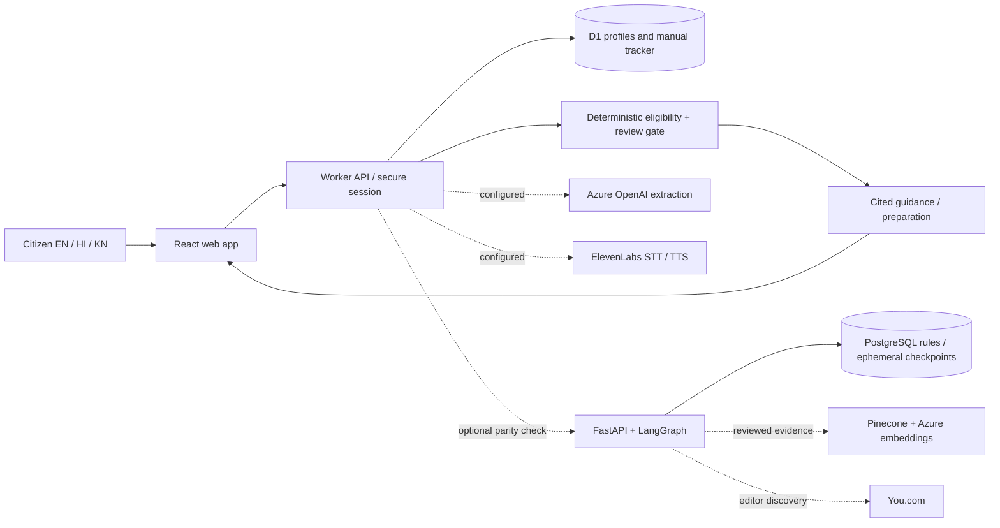

# Scheme Sathi

A deployed citizen-facing application for Central Government scheme discovery and preparation. **This is a working demonstration release, not a completed production eligibility service.**

## What works

- 50 unique programme references, search, ten categories, official links, benefits, and preparation guidance.
- English, Hindi and Kannada interface. Official programme summaries, names and criteria remain English; native-language expert review remains pending.
- Guided text intake and editable profile; no decision before explicit confirmation. Age/income/land/disability validation and optimistic concurrency prevent invalid or stale updates.
- Deterministic PASS / FAIL / UNKNOWN rules, nested AND / OR, four overall results, freshness and completeness checks. Unknown is never interpreted as false.
- Save schemes, check off preparation items, update manual status and notes; references retain only the last four characters. No government submission or live government status integration.
- One-hour cookie sessions; database persistence across refresh; session-specific data isolation; language preference, feedback and explicit deletion.
- Azure OpenAI extraction and ElevenLabs audio endpoints have real adapters, but are unavailable until configured. Text/forms work without them.
- Python FastAPI and LangGraph service, PostgreSQL catalogue/checkpointer integration, Pinecone evidence retrieval and You.com source-discovery adapters, Docker configuration, automated tests and CI definitions.

## Actual deployment and target architecture

The primary deployment runs React/Vinext directly on the project owner's Cloudflare Workers account with its own D1 database. Its address is https://india.scheme-sathi.workers.dev. It uses the TypeScript deterministic engine by default. The earlier Sites deployment remains separately available with its existing database; sessions and tracker records do not transfer between addresses. Azure infrastructure and paid-service credentials have not been connected.

See [Cloudflare deployment](docs/cloudflare-deployment.md) for deployment commands, authentication scopes, and resource configuration.

The separately runnable Python service is under `backend/`. Set `RULE_SERVICE_URL` and `RULE_SERVICE_API_KEY` on the Worker to require evaluation by that service. Its result must match the local scheme/rule version and deterministic result; failures or disagreements force abstention. This version does **not** move the citizen session/tracker database to PostgreSQL. The full Azure consolidation described in [target architecture](docs/target-architecture.md) remains deployment work, not a claim about the current endpoint.



## Run locally

Node 24 and pnpm 11:

```sh
pnpm install --frozen-lockfile
pnpm build
pnpm exec wrangler d1 execute site-creator-d1 --local --config dist/server/wrangler.json --persist-to .wrangler/state --file drizzle/0000_old_power_pack.sql
pnpm dev --hostname localhost --port 3000
```

Migrations run once per new local database. Deployment packaging applies Drizzle migrations through Sites; never put DDL in request handlers.

Leave the development server running in this terminal. Wait until it prints
`Local: http://localhost:3000/`, then run the checks in a **second PowerShell terminal**.
Set the test URL explicitly to replace any value left over from earlier runs:

```powershell
$env:TEST_BASE_URL = 'http://localhost:3000'
pnpm typecheck
pnpm lint
pnpm test
pnpm test:api
```

The API test needs the local server running. It creates synthetic sessions and deletes them when done. `TEST_BASE_URL` can select a test environment. Do not run mutating tests on a populated production account.

Use `localhost` in the test URL to match the server above. On Windows,
`localhost` can bind to IPv6 `::1`, so `127.0.0.1` may refuse connections even
while the server is running. Vinext uses `--hostname`, not `--host`. To bind
explicitly to IPv4, use `--hostname 127.0.0.1` and set `TEST_BASE_URL` to
`http://127.0.0.1:3000`.

`ECONNREFUSED` means no server is accepting connections at the requested
address; running `node tests/api.test.mjs` does not start one. If `pnpm dev`
reports an existing server but that URL refuses connections, stop the stalled
dev server with **Ctrl+C in its original terminal**, restart it, and wait for
the Local URL before rerunning the tests.

The server port and `TEST_BASE_URL` port must match. Setting `TEST_BASE_URL`
only changes where tests send requests; it does not start or reconfigure the
server. If you deliberately start the server on a different port, use the
Local URL it prints as `TEST_BASE_URL`.

Python backend, local catalogue mode (no PostgreSQL). In PowerShell, run from
the project root. Call the virtual environment's Python directly; activation
and execution-policy changes are unnecessary. Create the environment once:

The environment is stored in `backend\.venv`. The relative interpreter path
depends on your terminal's current directory (`Get-Location`):

| Current directory | Python command |
| --- | --- |
| `SchemeSathi` (project root) | `.\backend\.venv\Scripts\python.exe` |
| `SchemeSathi\backend` | `.\.venv\Scripts\python.exe` |

All commands below assume the project root. If the terminal is inside
`backend`, run `Set-Location ..` first. An error saying the executable is
"not recognized" can mean the relative path points to the wrong directory.

```powershell
python -m venv backend\.venv
.\backend\.venv\Scripts\python.exe -m pip install -r backend\requirements.lock
```

If the Windows launcher reports `No suitable Python runtime found`, run
`py --list` to see installed versions. A command such as `py -3.12` requires
that specific version. If Python 3.13 is listed, create the environment with
`py -3.13 -m venv backend\.venv`, then use its `Scripts\python.exe` as above.
You can also bypass the launcher by calling the installed interpreter's full
path with PowerShell's `&` operator.

Start the Python service in its own terminal:

```powershell
if (-not (Test-Path .\.env.backend-local-key)) {
  .\backend\.venv\Scripts\python.exe -c "from pathlib import Path; import secrets; Path('.env.backend-local-key').write_text(secrets.token_urlsafe(32), encoding='utf-8')"
}
$env:SERVICE_API_KEY = (Get-Content -Raw .\.env.backend-local-key).Trim()
$env:STORAGE_MODE = 'catalogue'
.\backend\.venv\Scripts\python.exe -m uvicorn sathi.app:app --app-dir backend --host 127.0.0.1 --port 8000 --no-access-log
```

Leave this terminal running and wait for `Application startup complete` and
`Uvicorn running on http://127.0.0.1:8000`. The development key is stored in
`.env.backend-local-key`, which Git ignores, so another terminal can use the
same key. PowerShell variables set in one terminal are not shared with another.

To call the Python API, open a second PowerShell terminal at the project root:

```powershell
Invoke-RestMethod -Uri 'http://127.0.0.1:8000/health/ready'
$serviceKey = (Get-Content -Raw .\.env.backend-local-key).Trim()
$body = @{
  sessionId = [guid]::NewGuid().ToString()
  profile = @{ age = 40 }
  confirmed = @('age')
  profileVersion = 1
} | ConvertTo-Json -Depth 5
$request = @{
  Uri = 'http://127.0.0.1:8000/v1/evaluate'
  Method = 'Post'
  Headers = @{ Authorization = "Bearer $serviceKey" }
  ContentType = 'application/json'
  Body = $body
}
$result = Invoke-RestMethod @request
$result | ConvertTo-Json -Depth 10
```

If the health request reports a refused connection, check the service terminal
for startup errors; changing the request body or key will not fix a missing
listener. Port 8000 serves the Python API; port 3000 serves the web app.

Run backend tests from the project root in another terminal. These tests do
not require a running service:

```powershell
.\backend\.venv\Scripts\python.exe -m pytest -c backend\pytest.ini backend\tests -q
```

On macOS/Linux, the interpreter is `backend/.venv/bin/python` instead of
`backend\.venv\Scripts\python.exe`; set environment variables using `export`.

For PostgreSQL, set `DATABASE_URL` and `STORAGE_MODE=postgres`, run `python migrate.py` using a migration role, then start the service. Alternatively set `POSTGRES_PASSWORD` and `SERVICE_API_KEY` and run `docker compose up --build` from the project root. Use URL-safe passwords in the supplied Compose connection string or supply an encoded DATABASE_URL.

Docker Compose now keeps D1 as the web API's primary database and mirrors saved
applications and user profiles into PostgreSQL, including updates and deletes.
The `storage-sync` service retries queued changes after outages. See
[PostgreSQL persistence and migration](docs/postgres-storage.md) for configuration,
failure behavior, verification, and the remaining steps for a PostgreSQL-only app.

Stop the standalone Uvicorn service before starting Docker Compose: both use
`127.0.0.1:8000`. Only one can listen on that address at a time. With Compose
running, `/health/ready` should report `storage: postgres`.

For Docker Compose, keep `POSTGRES_PASSWORD` and `SERVICE_API_KEY` in the
project-root `.env` file to reuse them across terminals. Compose reads that
file automatically; it is ignored by Git. Keep the PostgreSQL password
consistent with an existing database volume. Shell environment variables
override `.env`, so clear stale overrides if Compose uses unexpected values:

```powershell
Remove-Item Env:POSTGRES_PASSWORD, Env:SERVICE_API_KEY -ErrorAction SilentlyContinue
docker compose config --quiet
docker compose up --build
```

## API

Base path `/api/v1`. Mutations require a same-origin request and `X-Requested-With: SchemeSathi`. Session token is an HttpOnly, SameSite=Lax cookie, Secure over HTTPS. No CORS is enabled.

| Endpoint | Purpose |
| --- | --- |
| GET `/schemes`, `/schemes/:id` | Catalogue and references |
| GET `/capabilities` | Actual configured services |
| POST / GET `/sessions` | Create/read session |
| POST `/chat` | Proposed profile facts; confirmation required |
| PUT `/profile/confirm` | `{profile, version, confirmed:true}` |
| GET `/recommendations` | Deterministic results and citations |
| GET / POST `/applications` | Read/save owned schemes |
| PATCH / DELETE `/applications/:id` | Update/remove owned manual records |
| PUT `/privacy/consent` | Session language and preference choice |
| DELETE `/me/data` | Delete profile, tracker and feedback |
| POST `/feedback` | Rating and redacted comment |
| POST `/voice/transcribe`, `/voice/synthesize` | Optional ElevenLabs |
| GET `/health/live`, `/health/ready` | Health, also exposed outside API prefix |

Python: `/docs` has OpenAPI. All `/v1` endpoints require the server-to-server bearer key. Never put it in browser JavaScript. `/v1/evaluate` runs the graph; `/v1/evidence/{scheme_id}` returns version-filtered reviewed excerpts; `/v1/admin/discover` returns source candidates. Provider responses never approve rules.

## Production release gaps

1. **All 50 records are DRAFT and incomplete.** The release intentionally abstains on eligibility. Source visits are not independent review. Documents/checklists are generic preparation prompts until scheme-specific requirements are reviewed. No fixture is presented as an official rule set.
2. Complete each scheme's current rules, exclusions, household definitions, effective dates, application windows, exact clause references and document alternatives. Have a different named person review the complete manifest. Commit the review evidence and use `scripts/validate-release.mjs`. Unreviewed rules cannot be enabled.
3. Set cloud/provider secrets, index approved evidence, and test Azure OpenAI, ElevenLabs, Pinecone and You.com against real accounts. Azure resource provisioning and live-provider tests were not possible without account access.
4. mem0, external evaluation platforms and training experiments are not active runtime features. See the all-tool mapping in the target architecture. No fine-tuned model or evaluation-platform integration is claimed to exist.
5. Native-speaker review, 150+ expert-adjudicated real scheme cases, browser accessibility/usability testing, load testing, recovery drills, deployment security review and production monitoring remain release gates. Existing regression cases are synthetic engineering tests.
6. Persistent return-user accounts and long-term trackers require an identity/retention design. This version uses one-hour sessions and deletes expired rows opportunistically on new-session creation. Deletion removes active records immediately; platform backups follow provider retention. PostgreSQL graph checkpoints are removed in `finally`; an operational cleanup job is still required for interrupted/crashed runs.

## Privacy and operations

No raw audio or conversation history is written to the database. Server logs contain failure status and trace ID only. Numeric IDs, PAN-style identifiers and email addresses are masked in free text; this is not a guarantee of exhaustive PII detection. Browser guidance asks users not to provide identifiers. mem0 is disabled in this release and no data is sent there. Provider inputs are limited to explicitly submitted text or public scheme metadata. Never add API keys to source or hosting.json.

The generated shadcn catalogue includes unused components with upstream lint findings. `pnpm lint` checks application-owned app/lib/db/tests/scripts; generated vendor components are kept intact.

The optional WebMCP search tool changes the visible search field; browser-side registration was not exercised because browser QA was outside the authorized Sites workflow. Standard UI/API functionality does not depend on WebMCP.
