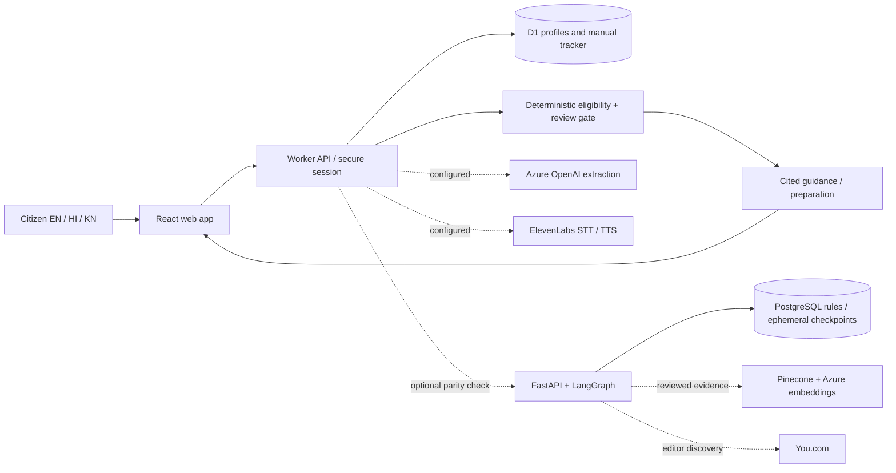

# Scheme Sathi

A deployed citizen-facing application for Central Government scheme discovery and preparation. **This is a working demonstration release, not a completed production eligibility service.**

## What works

- 50 unique programme references, search, ten categories, official links, benefits, and preparation guidance.
- English, Hindi and Kannada interface. Official programme summaries, names and criteria remain English; native-language expert review remains pending.
- Guided text intake and editable profile; no decision before explicit confirmation. Age/income/land/disability validation and optimistic concurrency prevent invalid or stale updates.
- Deterministic PASS / FAIL / UNKNOWN rules, nested AND / OR, four overall results, freshness and completeness checks. Unknown is never interpreted as false.
- Save schemes, check off preparation items, update manual status and notes; references retain only the last four characters. No government submission or live government status integration.
- One-hour cookie sessions; database persistence across refresh; session-specific data isolation; language preference, feedback and explicit deletion.
- Azure OpenAI extraction and ElevenLabs audio endpoints have real adapters, but are unavailable until configured. Text/forms work without them.
- Python FastAPI and LangGraph service, PostgreSQL catalogue/checkpointer integration, Pinecone evidence retrieval and You.com source-discovery adapters, Docker configuration, automated tests and CI definitions.

## Actual deployment and target architecture

The live web application runs React/Vinext on Sites with a Cloudflare Worker API and D1. It uses the TypeScript deterministic engine by default. These hosting resources were available in this session; Azure infrastructure and paid-service credentials were not.

The separately runnable Python service is under `backend/`. Set `RULE_SERVICE_URL` and `RULE_SERVICE_API_KEY` on the Worker to require evaluation by that service. Its result must match the local scheme/rule version and deterministic result; failures or disagreements force abstention. This version does **not** move the citizen session/tracker database to PostgreSQL. The full Azure consolidation described in [target architecture](docs/target-architecture.md) remains deployment work, not a claim about the current endpoint.



## Run locally

Node 24 and pnpm 11:

```sh
pnpm install --frozen-lockfile
pnpm build
pnpm exec wrangler d1 execute site-creator-d1 --local --config dist/server/wrangler.json --persist-to .wrangler/state --file drizzle/0000_old_power_pack.sql
pnpm dev --host 127.0.0.1
```

Migrations run once per new local database. Deployment packaging applies Drizzle migrations through Sites; never put DDL in request handlers.

```sh
pnpm typecheck
pnpm lint
pnpm test
pnpm test:api
```

The API test needs the local server running. It creates synthetic sessions and deletes them when done. `TEST_BASE_URL` can select a test environment. Do not run mutating tests on a populated production account.

Python backend, local catalogue mode (no PostgreSQL):

```sh
python -m venv backend/.venv
# Activate the virtual environment using your shell's standard command.
pip install -r backend/requirements.lock
cd backend
# Set SERVICE_API_KEY to a random secret; set STORAGE_MODE=catalogue for local evaluation.
uvicorn sathi.app:app --host 127.0.0.1 --port 8000 --no-access-log
python -m pytest -q
```

For PostgreSQL, set `DATABASE_URL` and `STORAGE_MODE=postgres`, run `python migrate.py` using a migration role, then start the service. Alternatively set `POSTGRES_PASSWORD` and `SERVICE_API_KEY` and run `docker compose up --build` from the project root. Use URL-safe passwords in the supplied Compose connection string or supply an encoded DATABASE_URL. Docker/PostgreSQL execution has not been tested in this environment.

## API

Base path `/api/v1`. Mutations require a same-origin request and `X-Requested-With: SchemeSathi`. Session token is an HttpOnly, SameSite=Lax cookie, Secure over HTTPS. No CORS is enabled.

| Endpoint | Purpose |
| --- | --- |
| GET `/schemes`, `/schemes/:id` | Catalogue and references |
| GET `/capabilities` | Actual configured services |
| POST / GET `/sessions` | Create/read session |
| POST `/chat` | Proposed profile facts; confirmation required |
| PUT `/profile/confirm` | `{profile, version, confirmed:true}` |
| GET `/recommendations` | Deterministic results and citations |
| GET / POST `/applications` | Read/save owned schemes |
| PATCH / DELETE `/applications/:id` | Update/remove owned manual records |
| PUT `/privacy/consent` | Session language and preference choice |
| DELETE `/me/data` | Delete profile, tracker and feedback |
| POST `/feedback` | Rating and redacted comment |
| POST `/voice/transcribe`, `/voice/synthesize` | Optional ElevenLabs |
| GET `/health/live`, `/health/ready` | Health, also exposed outside API prefix |

Python: `/docs` has OpenAPI. All `/v1` endpoints require the server-to-server bearer key. Never put it in browser JavaScript. `/v1/evaluate` runs the graph; `/v1/evidence/{scheme_id}` returns version-filtered reviewed excerpts; `/v1/admin/discover` returns source candidates. Provider responses never approve rules.

## Production release gaps

1. **All 50 records are DRAFT and incomplete.** The release intentionally abstains on eligibility. Source visits are not independent review. Documents/checklists are generic preparation prompts until scheme-specific requirements are reviewed. No fixture is presented as an official rule set.
2. Complete each scheme's current rules, exclusions, household definitions, effective dates, application windows, exact clause references and document alternatives. Have a different named person review the complete manifest. Commit the review evidence and use `scripts/validate-release.mjs`. Unreviewed rules cannot be enabled.
3. Set cloud/provider secrets, index approved evidence, and test Azure OpenAI, ElevenLabs, Pinecone and You.com against real accounts. Azure resource provisioning and live-provider tests were not possible without account access.
4. mem0, external evaluation platforms and training experiments are not active runtime features. See the all-tool mapping in the target architecture. No fine-tuned model or evaluation-platform integration is claimed to exist.
5. Native-speaker review, 150+ expert-adjudicated real scheme cases, browser accessibility/usability testing, load testing, recovery drills, deployment security review and production monitoring remain release gates. Existing regression cases are synthetic engineering tests.
6. Persistent return-user accounts and long-term trackers require an identity/retention design. This version uses one-hour sessions and deletes expired rows opportunistically on new-session creation. Deletion removes active records immediately; platform backups follow provider retention. PostgreSQL graph checkpoints are removed in `finally`; an operational cleanup job is still required for interrupted/crashed runs.

## Privacy and operations

No raw audio or conversation history is written to the database. Server logs contain failure status and trace ID only. Numeric IDs, PAN-style identifiers and email addresses are masked in free text; this is not a guarantee of exhaustive PII detection. Browser guidance asks users not to provide identifiers. mem0 is disabled in this release and no data is sent there. Provider inputs are limited to explicitly submitted text or public scheme metadata. Never add API keys to source or hosting.json.

The generated shadcn catalogue includes unused components with upstream lint findings. `pnpm lint` checks application-owned app/lib/db/tests/scripts; generated vendor components are kept intact.

The optional WebMCP search tool changes the visible search field; browser-side registration was not exercised because browser QA was outside the authorized Sites workflow. Standard UI/API functionality does not depend on WebMCP.
