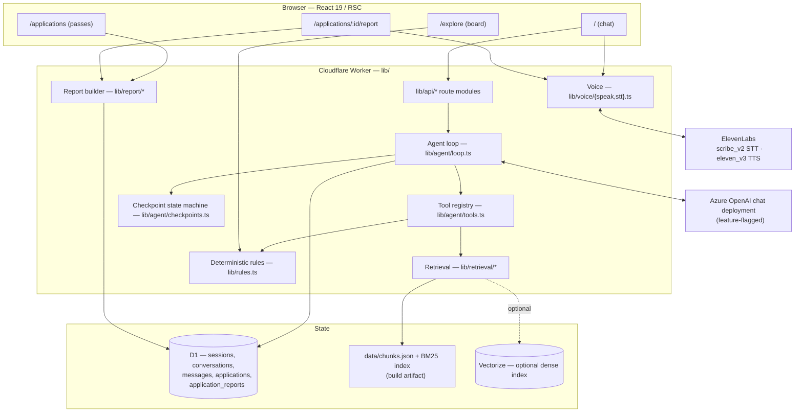
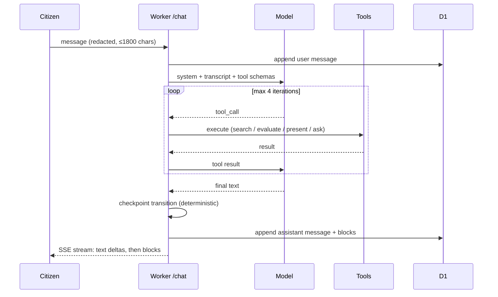
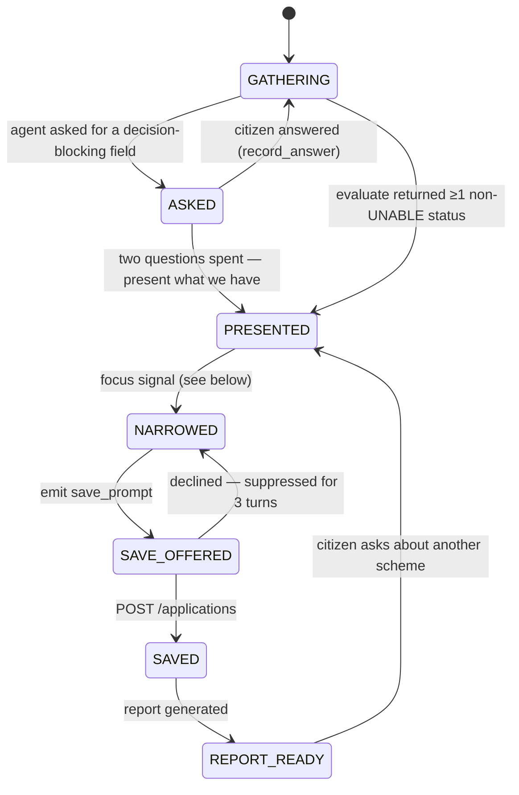

# Scheme Sathi — Agent, Retrieval and Application Architecture

Implementation plan, 10 September 2026. Branch `feature/Frontend`.

This document describes the target architecture for the conversational layer of Scheme Sathi and the plan to build it. **No code has been changed.** It supersedes nothing in [`docs/target-architecture.md`](target-architecture.md) — that document remains the long-range proposal; this one is the buildable subset for the deployed Cloudflare Worker, with explicit deviations noted in §13.

Scope of this plan:

1. A retrieval layer (RAG) over the 50-scheme catalogue.
2. A real multi-turn chat agent replacing the current one-shot `POST /chat`.
3. Rich structured cards in the chat transcript instead of prose dumps of scheme data.
4. Deterministic **jump points** — the moments where the conversation offers the citizen a concrete next action, chiefly "save this to My applications".
5. A detailed, printable **next-steps report** per saved application.

---

## 1. Where we are today

| Layer | Current state | File |
| --- | --- | --- |
| Runtime | vinext 1.0.0-beta.5 (Next-style RSC) on Cloudflare Workers | `vite.config.ts`, `wrangler.cloudflare.jsonc` |
| API | One fat handler, path-matched, ~660 lines | `lib/server.ts` |
| Storage | D1 (SQLite), Drizzle schema, one migration | `db/schema.ts`, `drizzle/0000_*.sql` |
| Catalogue | 50 schemes as a committed JSON array, imported at build time | `data/schemes.json`, `lib/catalogue.ts` |
| Eligibility | Deterministic rule-tree evaluator, PASS/FAIL/UNKNOWN per rule | `lib/rules.ts` |
| Chat | **One shot.** `POST /chat` → LLM field extraction → opens the profile dialog. No transcript, no turns, no memory. | `lib/server.ts`, `app/providers.tsx` |
| Voice | ElevenLabs STT (`scribe_v2`) fills the landing composer; TTS (`eleven_v3`) can only speak a *scheme record*. Gated by `capabilities.voice`. | `lib/server.ts`, `app/providers.tsx` |
| Retrieval | **None in the Worker.** A Pinecone + Azure adapter exists in the optional Python service and is gated off. | `backend/sathi/providers.py` |
| Applications | `schemeId`, `status`, `reference`, `notes`, `checklist[]`. No conversation link, no summary, no report. | `db/schema.ts` |
| Design | "The Gate Board and the Pass" — ink on paper, hairlines, mono labels, print as a shipping surface | `DESIGN.md` |

Three facts constrain every decision below:

- **The eligibility verdict is never the model's to make.** `evaluateScheme()` produces the status; the LLM may only explain it. This is a product commitment (`PRODUCT.md`), and the Python parity service already fails a request rather than let statuses diverge.
- **Everything is session-scoped and anonymous.** A session is a cookie with a 60-minute TTL and applications cascade-delete with it (`db/schema.ts:36`). See §10 — this is the single biggest thing this plan forces us to confront.
- **Desktop only, three languages, print matters.** Any new surface ships in `lib/i18n.ts` and gets a `.no-print` / `break-inside: avoid` pass.

---

## 2. Architecture at a glance



**Placement decision: the agent lives in the Worker, not the Python service.** `backend/` keeps its single job — an optional rule-parity checker reached over `RULE_SERVICE_URL`, whose disagreement downgrades every decision to `UNABLE_TO_DETERMINE`. Adding a second deployment target to the request path for chat would double the failure surface for no capability we cannot get in the Worker. LangGraph stays where it is, as the parity harness the architecture doc describes.

---

## 3. Retrieval (RAG)

### 3.1 The honest sizing

The corpus is 50 schemes, ~1.2 KB of prose each. Chunked as described below it is roughly **300–400 chunks, under 500 KB total**. That is small enough to hold in Worker memory. A vector database here buys us multilingual query matching and semantic recall, not scale. So the design is lexical-first with dense retrieval as a genuine enhancement rather than the foundation — which also means retrieval degrades to "still works" when no AI keys are configured, matching how `capabilities` already gates `ai`, `voice` and `retrieval`.

### 3.2 Chunk contract

A build script (`scripts/build-index.mjs`, run in `prebuild`) turns `data/schemes.json` into `data/chunks.json`. Chunks are **typed and structural** — a chunk never splits a rule from its qualifier:

```ts
type Chunk = {
  id: string;                  // `${schemeId}:${kind}:${n}`
  schemeId: string;
  schemeVersion: string;       // must match Scheme.version at query time
  reviewStatus: 'DRAFT' | 'VERIFIED';
  kind: 'identity' | 'eligibility' | 'benefit' | 'documents' | 'steps' | 'tags';
  text: string;                // 400–800 tokens, headers preserved
  source: string;              // official URL from the scheme record
  lang: 'en';                  // corpus is English; see §3.5
};
```

The same script emits `data/bm25.json`: term → postings, doc lengths, avgdl. Precomputing it keeps cold-start work at zero and makes the ranking reproducible in `node --test`.

### 3.3 Retrieval pipeline

```
query
  ├─ lexical: BM25 over data/bm25.json          → top 20
  ├─ dense  : Workers AI bge-m3 → Vectorize      → top 20   [optional]
  ├─ fuse   : reciprocal rank fusion (k = 60)
  ├─ filter : scheme_id + version + reviewStatus must match the live catalogue
  ├─ group  : chunks → distinct schemeIds (max 8)
  └─ rank   : by deterministic decision status, then fused score
```

Two rules that are not negotiable:

- **Retrieval narrows; it never decides.** The output of §3.3 is a candidate set of `schemeId`s. Each candidate is then passed through `evaluateScheme()` and it is *that* status which reaches the citizen. A scheme that retrieval ranks first and the rules engine marks `LIKELY_NOT_ELIGIBLE` is presented as not eligible.
- **Every citation resolves to the source registry.** The model receives chunk IDs, never URLs. When it cites `pm-kisan:steps:0`, the server substitutes `scheme.source`. This is the same discipline `backend/sathi/providers.py:official_url` enforces on the Python side, and it is why the model cannot invent a `.gov.in` link.

### 3.4 Dense layer: recommendation

Use **Cloudflare Vectorize + Workers AI `@cf/baai/bge-m3`** rather than Azure embeddings + Pinecone.

| | Vectorize + Workers AI | Pinecone + Azure |
| --- | --- | --- |
| Infra | Two bindings in `wrangler.cloudflare.jsonc` | Two external services, two more secrets |
| Latency | In-network from the Worker | Two cross-region round trips per query |
| Multilingual | bge-m3 embeds hi/kn/en into one space — matches our three languages directly | `text-embedding-3-small` is weaker on Kannada |
| Matches `docs/target-architecture.md` | No — a documented deviation | Yes |

The deviation is recorded in §13. The index manifest contract from the architecture doc (`scheme_id + content_version + source_id`, approved status, corpus generation) is kept verbatim; only the vendor changes. Ship behind `capabilities.retrieval` so the app is fully functional with the binding absent.

### 3.5 Language

The corpus is English. A Hindi or Kannada query is handled by embedding the query as-is (bge-m3 is cross-lingual) **and** running BM25 against an English rewrite produced by the same LLM call that does profile extraction. Retrieving English evidence for a Kannada question is correct behaviour, not a failure — the UI already states this (`t.sourceEnglish`). A strict language filter must never produce a false "no evidence".

---

## 4. The conversational agent

### 4.1 Turn loop



Hard bounds, enforced server-side: **4 tool iterations**, **20 s wall clock**, **8 schemes per `present_schemes` call**, transcript truncated to the last 12 turns plus a rolling summary. Exceeding any bound ends the turn with whatever blocks were produced and a plain notice — never a silent stall.

### 4.2 Tools

| Tool | Input | Effect | Returns to model |
| --- | --- | --- | --- |
| `search_schemes` | `query`, optional `category` | §3.3 pipeline | ranked `schemeId[]` + chunk excerpts + chunk IDs |
| `propose_profile` | `Partial<Profile>` | validated by `validateProfile()`, written **unconfirmed** | accepted fields, rejected fields with reasons |
| `record_answer` | `field`, `value` | writes one field and marks it **confirmed** — only valid as a direct reply to a question the agent asked | accepted value, or a validation reason to re-ask |
| `evaluate` | — | `evaluateScheme()` over the confirmed profile | statuses, failing rule labels, `missingFields[]` |
| `ask_for_field` | `field`, `why` | the agent asks the question **in its own prose**; optional `answer_chips` block attached | acknowledgement only |
| `present_schemes` | `schemeId[]`, per-scheme `whyThis` (≤180 chars) | emits `scheme_card` blocks | acknowledgement only |
| `compare_schemes` | `schemeId[]` (2–4) | emits a `scheme_compare` mini-board | acknowledgement only |
| `focus_scheme` | `schemeId` | marks the conversation's focus; feeds §6 | acknowledgement only |

The split between the two write tools is the product's second promise made structural. `propose_profile` records what the agent *inferred* from narrative and leaves it unconfirmed; `record_answer` records what the citizen *told us directly* and marks it confirmed. Only confirmed fields reach `evaluateScheme()`. A model cannot promote its own inference — `record_answer` is rejected unless the immediately preceding assistant turn asked for that field.

Note there is deliberately no `save_application` tool. Saving is a jump point (§6), decided by the server, actioned by the citizen.

### 4.3 System prompt constraints

The prompt is a versioned file (`lib/agent/prompt.ts`), not an inline string, and states: never assert eligibility in prose; never state a rupee amount not present in a supplied chunk; never produce a URL; when a fact is missing say so and call `ask_for_field`; keep prose under 90 words per turn because the cards carry the detail.

A post-generation validator drops any assistant sentence containing a currency figure, a percentage, or a bare URL that is not traceable to a supplied chunk, and replaces it with the deterministic sentence from the scheme record. One repair attempt, then abstain — same policy as §6 of the architecture doc.

### 4.4 Where the profile lives

**The profile is its own surface, not a step in the chat.** A dedicated `/profile` route owns it: every field, its value, whether it is confirmed, and where it came from. The agent reads from it on every turn and writes back to it; the citizen can open it at any moment to review or correct anything. Nothing about it is modal, and it never interrupts a conversation.

This replaces the current flow, where `ask()` posts one message and immediately throws the citizen into `ProfileDialog` (`app/providers.tsx`). That dialog is a form wearing a chat's clothes: it stops the conversation dead at turn one and asks someone who has just described their life in their own words to re-enter it as fields.

So there is **no `profile_confirm` card in the transcript**. When the agent lacks a decision-relevant fact, it does the obvious thing — **it asks, in the conversation, in prose**, and the citizen answers by typing. That is the whole interaction model: ordinary question-and-answer turns, the paradigm every chat interface already teaches. Answer chips may accompany a question as a shortcut, never as a replacement for typing.

Each field therefore carries a provenance:

| Provenance | How it got there | Confirmed? |
| --- | --- | --- |
| `answered` | the citizen answered the agent's direct question | **yes** |
| `entered` | the citizen typed or picked it on `/profile` | **yes** |
| `inferred` | the agent extracted it from narrative ("I farm two acres") | **no** |

Only confirmed fields are passed to `evaluateScheme()`, so an inference can never quietly become a verdict. An `inferred` field shows on `/profile` under the alert-yellow changed edge until the citizen accepts or edits it, and if it is blocking a decision the agent asks about it directly — at which point answering promotes it to `answered`.

**A direct answer to a direct question is a stronger confirmation than a ticked form**, which is why this satisfies "Nothing is decided until you check the details yourself" rather than weakening it. The citizen said it, in their own words, in reply to being asked. `/profile` is the durable record they can audit and correct at any time.

Consequence for the chat: the agent may ask at most **two** questions before it presents whatever it can with the facts it has. Interrogation is not conversation, and a citizen who has answered two questions deserves to see something.

### 4.5 No-AI degradation

With `AZURE_OPENAI_*` unset, `capabilities.ai` is already `false`. In that mode the chat surface stays: the composer runs the existing regex extractor (`lib/api/chat.ts`), retrieval runs BM25-only, and the response is deterministic — a fixed question drawn from the highest-leverage missing field, or `scheme_card`s for the top BM25 matches once enough is known. The transcript, the cards, the jump points, the save flow and the report all work. Only the prose is thinner. This mode is what CI tests against.

---

## 5. Structured blocks — "no text dump"

The transcript is an **ordinary chat**: alternating user and assistant turns, prose on both sides, a composer at the bottom, scrollback above. Blocks are not a replacement for that — they are what an assistant turn reaches for instead of dumping scheme data as paragraphs. The agent still talks like an assistant; when it has fifty facts about four programmes, it shows cards rather than writing them out.

An assistant message is `{ text: string, blocks: Block[] }`. Blocks are persisted with the message so a reload re-renders the transcript identically — a chat that loses its cards on refresh is worse than one that never had them.

```ts
type Block =
  | { kind: 'scheme_card'; schemeId: string; status: Decision['status'];
      whyThis: string; failing: RuleOutcome[]; missing: string[]; saved: boolean }
  | { kind: 'scheme_compare'; schemeIds: string[]; columns: ('benefit'|'status'|'docs')[] }
  | { kind: 'answer_chips'; field: string; options: { value: string; label: string }[] }
  | { kind: 'profile_updated'; fields: { field: string; provenance: 'answered' | 'inferred' }[] }
  | { kind: 'save_prompt'; schemeId: string; reason: string }
  | { kind: 'saved_receipt'; applicationId: string; schemeId: string }
  | { kind: 'report_ready'; applicationId: string }
  | { kind: 'sources'; items: { schemeId: string; title: string; url: string }[] }
  | { kind: 'notice'; tone: 'info' | 'error'; text: string };
```

### 5.1 How each block reads in the design system

`DESIGN.md` already gives us the vocabulary; nothing new is invented.

- **`scheme_card`** — a compact **pass**. Ink header carrying the ministry label and the status pill; white body with the programme name at 600 and the `whyThis` line beneath; a `pass-seg` row of three dashed cells (`WHAT YOU GET` / `DOCUMENTS` / `STEPS`), each a mono uppercase label over a tabular figure; a stub with *Save* and *Details*. Failing rules render as up to two 20px status rule-marks with their labels — the reason is on the card, not hidden behind a dialog.
- **`scheme_compare`** — a **board** at chat width. Ink bar, mono column heads, one row per scheme, hairline separated. If all rows share a verdict, the condition strip states it once and the status column disappears — the existing rule from `app/explore/page.tsx`.
- **`answer_chips`** — the question itself is **assistant prose, not a block**; this is only the shortcut row beneath it. Chips are `panel`-filled with a hairline, mono uppercase, sitting directly under the turn. Clicking one sends it as a normal user message, so the transcript reads identically whether the citizen tapped or typed. Typing a free answer — including "I don't know" — is always available and always accepted. Never rendered without a question above it, and never more than one set at a time.
- **`profile_updated`** — a single hairline line, not a card: *"Added to your profile: occupation — farmer"* with a quiet link to `/profile`. It exists so the citizen can see that answering a question fed the durable record, and can go correct it. An `inferred` field is named as such. This block never blocks and never has a primary action.
- **`save_prompt`** — a `pass-blank`: full pass structure with its figures set in mist, an unissued document. The affirmative action issues it.
- **`sources`** — a hairline footnote strip, links appending their `href` in print.

All strings live in `lib/i18n.ts`. Blocks carry IDs and data, never rendered sentences, so a transcript renders correctly in a language the citizen switched to *after* the turn was generated.

### 5.2 Streaming

`POST /api/v1/conversations/:id/messages` responds `text/event-stream`: `delta` events for prose, then one `block` event per block, then `done` with the checkpoint. Blocks arrive after the text because several of them depend on tool results that complete mid-turn. On any transport failure the client falls back to `GET /conversations/:id/messages` — the message is already committed to D1 before the stream closes.

---

## 6. Jump points

A jump point is a deterministic transition, computed by `lib/agent/checkpoints.ts` **after** the model's turn, from state the server owns. The model can influence it (by calling `focus_scheme`) but cannot fire it. This matters: "would you like to save this?" arriving at the wrong moment is the difference between an advocate and a funnel.

The `sessions.checkpoint` column already exists (`START`, `AWAITING_CONFIRMATION`, `PROFILE_CONFIRMED`) and moves to the conversation record, extended:



**Focus signal — the condition for offering to save.** All of:

1. Checkpoint is `PRESENTED` or later.
2. A single `schemeId` is the subject of the last two turns (named by the citizen, or `focus_scheme`d, or the only card presented).
3. That scheme's status is `LIKELY_ELIGIBLE` or `POSSIBLY_ELIGIBLE`.
4. It is not already in `applications`.
5. No `save_prompt` for it was declined in the last 3 turns.

If the conversation ends at `PRESENTED` with several eligible schemes and no single focus, the terminal jump point is a `scheme_compare` plus a save affordance on each card — an offer, not a prompt. We do not manufacture a focus the citizen has not expressed.

Other jump points, same mechanism: an `UNABLE_TO_DETERMINE`-dominant evaluation → a question about the highest-leverage missing field, meaning the one blocking the most schemes, asked in prose with optional chips; two questions spent without resolution → present what we have anyway; `SAVED` → `report_ready`.

Profile confirmation is deliberately **not** a state here. It is not a phase of the conversation any more — it is a surface the citizen can visit at any point (§4.4), and it can advance the machine from the side simply by making more fields confirmed.

---

## 7. Voice — speaking a turn, and being read back

### 7.1 What already ships

Voice is the one capability in this plan that is half-built rather than absent:

- `POST /api/v1/voice/transcribe` — multipart, ≤5 MB, ElevenLabs `scribe_v2`, `language_code` derived from the session language (`eng` / `hin` / `kan`), response passed through `redact()`, returns `confirmationRequired: true`. Rate-limited to 8/hour.
- `POST /api/v1/voice/synthesize` — `eleven_v3`, takes a `schemeId`, speaks name + summary + the fixed guidance string, streams `audio/mpeg` with `no-store`.
- `record()` in `app/providers.tsx` — `MediaRecorder`, a 20-second hard stop so a forgotten recording cannot run on, tracks released on unmount, transcript dropped into the composer.
- Both gated by `capabilities.voice` (needs `ELEVENLABS_API_KEY` **and** `ELEVENLABS_VOICE_ID`), with `t.voiceOff` already translated into all three languages.

**The gap is shape, not plumbing.** Both endpoints were built for a one-shot landing page: the mic fills a single composer that then disappears into a dialog, and TTS can only speak a scheme record — there is no way to speak an assistant turn, because there are no turns yet.

This matters more here than voice usually does. `PRODUCT.md` describes someone unfamiliar with programme terminology who arrives with a life situation rather than a scheme name, on infrequent use. Typing *"I farm two acres in Kolar and my daughter is starting college"* in Kannada on a desktop keyboard is a real barrier for exactly that person. Voice is closer to a primary input path than an accessibility extra — which is also why it must not become a way to skip confirmation.

### 7.2 Speaking a turn (STT)

The mic moves into the chat composer and becomes per-turn. Push-to-talk, with an explicit state machine:

```
idle → recording → transcribing → draft in composer → (citizen edits) → sent
```

**Transcription is never auto-sent.** The endpoint already returns `confirmationRequired: true`; the new composer honours it. This is not caution for its own sake: `scribe_v2` on Indian place names, programme names and numerals is imperfect, and a misheard "two acres" as "ten acres" silently flips an eligibility verdict with no visible cause. The citizen reads the draft and edits it before sending — the same promise the profile confirm card makes, applied one step earlier.

The stored user message records `inputMode: 'voice' | 'text'`. That column earns itself twice over:

1. The agent's system prompt is told the turn was spoken, so disfluency, self-correction and run-on phrasing are not over-interpreted as content.
2. Any number that arrives by voice and lands in `propose_profile` stays `inferred` and carries the alert-yellow changed edge on `/profile` (§4.4) — so a mis-heard quantity is visibly a figure to check, not a fact quietly absorbed into the profile. A spoken *answer* to a direct question is the one case where the agent re-states the value in its next turn ("Two acres — noted") so a mishearing surfaces in the conversation itself.

Language needs no change: `language_code` continues to follow the session language, and §3.5's English-rewrite path takes a Kannada utterance through retrieval from there. Existing limits are kept as they are — 5 MB, 20-second client-side stop, 8 transcriptions/hour.

### 7.3 Being read back (TTS)

`/voice/synthesize` generalises from *"speak a scheme"* to *"speak a thing the server owns"*, and becomes `/voice/speak` with three callers:

| Target | What is spoken |
| --- | --- |
| `message` | the assistant turn's prose, then a spoken rendering of its blocks |
| `scheme` | today's behaviour — name, benefit, the status sentence, guidance |
| `report_step` | one step: title, detail, where, who, typical wait |

Two constraints do the real work here.

**Cards cannot be spoken as they are rendered, and the model does not write the audio script.** Each block kind gets a deterministic `speak()` in `lib/voice/speak.ts`, composed from the same `lib/i18n.ts` strings the block renders — a `scheme_card` becomes *"PM-KISAN. Status: likely eligible. What you get: … Four documents, four steps."* A `scheme_compare` speaks the count and the leading row, then "the rest are on screen"; reading four rows of a comparison table aloud helps nobody. This keeps §4.3's rule intact end to end — no rupee figure, status or URL reaches audio that did not come from the scheme record — and it keeps the spoken version in sync with the screen automatically whenever copy changes.

**The client never posts a script to be spoken.** The request is `{ target, id, stepN? }` and the server resolves the text from its own state. Accepting arbitrary text would turn the endpoint into an open TTS proxy running on our ElevenLabs key.

Playback is one speaker control per assistant message and per report step, sharing a single audio element so starting one stops the previous. Streamed `audio/mpeg`, never cached, 8 playbacks/hour.

### 7.4 Degradation, privacy, design

- `capabilities.voice === false` → the mic and speaker controls are **absent**, not disabled-with-a-tooltip on every turn. The existing `t.voiceOff` notice covers a direct attempt.
- **Autoplay is never used.** Someone on a shared or public machine does not get sound they did not ask for, and a report about a disability pension should not announce itself.
- **No audio is stored.** The blob goes to ElevenLabs and is discarded; only the redacted transcript persists — already true today, and worth keeping true.
- Design: the mic is the existing `micbtn` relocated into the composer bar, keeping its current pressed treatment while recording. The speaker is a small icon button in the message's hairline footer, taking **alert yellow only while playing** — which is precisely what `DESIGN.md` reserves that colour for (change and attention), not decoration. Both are `.no-print`; a printed report carries no playback affordance.

### 7.5 Cost and failure

Every spoken turn is a paid call on our key, and it is the only per-turn variable cost a citizen can trigger repeatedly. Keep the 8/hour caps rather than raising them to feel generous, and measure before loosening (§14).

On any ElevenLabs 4xx/5xx the turn stays fully usable as text and the existing notice appears. Voice sits beside the critical path in both directions — never on it.

---

## 8. Data model

Additions to `db/schema.ts`, one new migration.

```ts
conversations = {
  id, owner → sessions.id (cascade),
  language, checkpoint,            // GATHERING … REPORT_READY
  focusSchemeId | null,
  title,                           // first user message, 60 chars
  rollingSummary,                  // ≤400 chars, refreshed every 6 turns — runtime
                                   // context management only; never surfaced,
                                   // never copied onto an application
  createdAt, updatedAt,
}                                  // index (owner, updatedAt)

messages = {
  id, conversationId → conversations.id (cascade),
  role: 'user' | 'assistant',
  text,
  inputMode: 'text' | 'voice',     // user messages only — see §7.2
  blocks,                          // JSON Block[]
  toolCalls,                       // JSON, diagnostics + trace ID
  createdAt,
}                                  // index (conversationId, createdAt)
```

`sessions` gains a `provenance` column: a JSON map of `field -> 'answered' | 'entered' | 'inferred'`, kept beside the existing `profile` and `confirmed` columns. `confirmed[]` stays the authority for `evaluateScheme()`; provenance is what `/profile` renders and what stops an inference being mistaken for a statement (§4.4).

`applications` gains:

| Column | Purpose |
| --- | --- |
| `conversationId` | trace only — which conversation produced this. Nullable, no UI, no read path outside diagnostics |
| `decisionSnapshot` | JSON `Decision` at save time — the report must not silently change when the profile does |
| `schemeVersion` | the catalogue version saved against |

```ts
application_reports = {
  id, applicationId → applications.id (cascade),
  payload,                         // JSON Report, §9.2
  schemeVersion, decisionHash,     // regenerate when either drifts
  generatedAt, mode,               // 'ai' | 'deterministic'
}
```

**Revised 11 September 2026 — partly reversed.** The earlier decision was that nothing conversational is stored on the application, on the reasoning that the report did not need it. §9 now says the report opens with the citizen's own context, so that reasoning no longer holds.

What changed, precisely:

- **`applications` still gains no summary column.** The applications list shows the decision, not a paragraph.
- **The recap lives in the report payload** (`application_reports.payload.yourSituation.recap`), written once when the report is generated and frozen there with the rest of it. A report is a document with a date on it; its recap should not drift after printing.
- **The structured half of the context is not conversational at all** — `yourSituation.confirmed` is the confirmed profile with provenance, which the session already holds. That part needs no LLM and no storage.

So the summary returns, but as one field inside a dated document rather than as mutable state hanging off an application — which was the actual objection to it the first time.

`messages` still exists — a multi-turn chat cannot work without storing turns — but it is pure conversation state. It lives and dies with the session, needs no separate retention policy, and is never read by the applications or report surfaces.

The save path stays cheap — no LLM call, no summariser, no staleness — because the recap is written at report time, not at save time, and a report already has an explicit regeneration path (§9.3). In `deterministic` mode there is no recap at all and `yourSituation` carries only the confirmed facts, which is most of the value.

---

## 9. The next-steps report

### 9.1 Generation strategy

**Deterministic skeleton, LLM prose only in bounded slots.** Every structural fact in the report — documents, steps, official links, rule outcomes, missing fields, scheme version — comes from the scheme record and the decision snapshot. The model writes only: a two-sentence "what this is for you", a one-sentence elaboration per step, and the "if you are refused" paragraph. Each of those passes the §4.3 validator. If AI is unavailable, the slots fall back to the scheme's own `steps[]` text and the report still prints, marked `mode: deterministic`.

This is the right split because the report is the artefact a citizen carries into a government office. A hallucinated document requirement wastes a person's day and a bus fare.

**Revised 11 September 2026: the citizen's context is an input, and the steps are personalised to it.** Generic steps are the same four sentences for everyone; what a person actually has to do next depends on which rules they already satisfy, which facts are still unproven, and what they do not yet have. That personalisation must not become an opening for invention, so it is delivered in four layers, only the last of which is model output:

| Layer | Mechanism | Who decides |
| --- | --- | --- |
| **Which steps appear** | each step carries an optional `onlyIf` rule, evaluated by `evaluateTree()` against the confirmed profile | the existing rule engine |
| **Which steps are highlighted** | a step's `relatesTo` fields intersected with the decision's failing and unknown fields | deterministic |
| **Why it is highlighted** | rendered from the rule's own `label` through a fixed template | deterministic |
| **A recap of the conversation** | one bounded LLM call, ≤80 words, rendered as a quotation of the citizen's own account | the model, and only here |

So "next steps vary per scheme per citizen" is answered by **reusing the eligibility rule engine on the steps themselves**, not by asking a model to imagine what someone should do. A step is never written, reordered or invented by the model — it is authored in the catalogue, shown or hidden by a rule, and marked as theirs by a field comparison.

The recap is the one narrative slot, and it is deliberately non-instructional: it says what the citizen told us, never what they should do. A reader can ignore it entirely and the report still works.

### 9.2 Report shape

```ts
type Report = {
  scheme: { id, name, shortName, ministry, version, source, sourceCheckedAt };
  generatedAt: string;
  mode: 'ai' | 'deterministic';

  /** How this citizen arrived here. Opens the report. */
  yourSituation: {
    confirmed: { field: string; value: string; provenance: Provenance }[];
    recap: string | null;          // ≤80 words, non-instructional, AI mode only
    conversationId: string | null;
  };

  whatThisIs: string;              // ≤2 sentences

  whyYou: RuleOutcome[];           // rules this citizen already satisfies
  stillUnknown: {
    field: string;
    ruleLabel: string;             // from the rule, not written for the report
    provingDocument: string | null;
  }[];

  documents: {
    item: string;
    note: string;
    held: boolean;                 // ← their own checklist
    requiredBecause: string | null;  // the rule this document proves
  }[];

  /** Authored per scheme, filtered and marked per citizen. */
  steps: {
    n: number;
    title: string;
    detail: string;
    where: string;
    who: string;
    typicalWait: string;
    relevance: 'for_you' | 'standard' | 'already_done';
    becauseYou: string | null;     // rendered from the rule label
  }[];

  fees: string;
  officialLinks: { title: string; url: string }[];
  disclaimer: string;              // no final eligibility claim, per PRODUCT.md
};
```

`ifRefused` is **cut**. It had no grounding source in the catalogue, which would have made it the one paragraph in a document carried into a government office that pointed at nothing. It returns if and when a per-scheme authored field exists for it.

### 9.3 Surface

A route: `app/applications/[id]/report/page.tsx`. Reached from the application pass ("Next steps") and from the `report_ready` block in chat.

Rendered as a document, not a dashboard, and the design system already tells us how:

- Masthead as an inverted **pass header** — programme name, status pill, generated date, scheme version in mono.
- **`yourSituation` opens the document**, directly under the masthead: the confirmed facts as a `pass-seg` row of labelled figures, with the recap beneath as an indented quotation in the reading face. This is the part that makes the sheet legibly *theirs* rather than a printout of a scheme page.
- Steps marked `for_you` take the 3px **alert-yellow left edge** and carry their `becauseYou` line; `already_done` steps are set in mist with a rule through the number. The citizen should be able to find their own work on the page without reading it end to end.
- `whyYou` and `stillUnknown` as two labelled columns of rule marks. Unknowns are set at full weight and full size, exactly like the other verdicts (`DESIGN.md` do's) — an unknown is information, not an absence.
- Documents as a checklist with the citizen's held items ticked, so the printed sheet is *their* sheet.
- Steps as numbered blocks with a `pass-seg`-style dashed cell row beneath each (`WHERE` / `WHO` / `TYPICAL WAIT`) — the three questions someone actually has standing in a queue.
- Links append their `href` in 10px grey when printed.
- `@media print`: nav, top bar, footer and actions are `.no-print`; every block takes `break-inside: avoid`; the masthead inverts to white with a 2px black rule so it does not burn toner.

Regeneration: the report is cached in `application_reports` and invalidated when `schemeVersion` or `decisionHash` changes, with a visible "the scheme record changed — regenerate" notice rather than a silent swap under a document someone may have already printed.

---

## 10. The retention problem (open — blocks Phases 5–6)

Verified against the code as it now stands:

- `expires_at` is set to **creation time + 60 minutes and never refreshed** (`lib/api/sessions.ts:30`). This is a hard wall, not an idle timeout — someone still mid-conversation at minute 61 is cut off, and the cookie's `Max-Age=3600` expires with it.
- Expired sessions are swept on the next session creation (`lib/api/sessions.ts:18`).
- Cascading from `sessions`: `applications`, and `conversations` → `messages`. The profile, `confirmed[]` and `provenance` live on the session row itself.

So at minute 60 the citizen loses **everything**: their profile, every conversation, and every saved application.

That was defensible when a session meant a two-field tracker. It stopped being defensible when `/profile` shipped in Phase 4 — the product now presents a durable-looking record the citizen is invited to build and correct — and it gets worse in Phase 6, when "My applications" holds a report someone means to print and come back to.

Three options:

| Option | Effort | Trade-off |
| --- | --- | --- |
| **A. Rolling session** — refresh the cookie TTL on activity, extend to 30 days, keep it anonymous | Low | Cookie loss = data loss, with no recovery path. Honest if stated plainly. |
| **B. Recovery code** — issue a printable 8-word code at first save; entering it re-binds the session | Medium | No PII, no accounts, survives device loss, fits the "pass" metaphor exactly |
| **C. Accounts** | High | Contradicts the "no login, private, 60 min" promise on every screen |

**Decided (11 September 2026): A, implemented.** `SESSION_TTL` is 30 days, pushed back out on any authenticated request once the window is more than half spent (`lib/session.ts`, applied in the dispatcher). The 60-minute copy is gone from the UI, and `t.retentionNote` states the loss A still permits — clear your browser data or switch device and it is gone, with no recovery — on `/profile` and in settings, which is the condition that makes A honest.

**B remains the recommendation before this reaches a real citizen.** B is genuinely in the spirit of the product — a claim stub you keep — and it is the only one of the three that lets a citizen print a report today and open it next week. C is out of scope for this phase.

Conversation transcripts are the one part that is genuinely fine to lose — by design they were never meant to outlive the session (§8). The profile and the saved applications are not.

Phase 4 shipped without this resolved, which was a deliberate call: the UI does not depend on the answer, and blocking it would have delivered nothing. But the product should not go in front of a citizen until it is decided, because the screen now invites investment that the storage does not honour.

---

## 11. API surface

| Method | Path | Purpose |
| --- | --- | --- |
| `POST` | `/api/v1/conversations` | start; returns id + checkpoint |
| `GET` | `/api/v1/conversations` | list for the session (chat history rail) |
| `GET` | `/api/v1/conversations/:id/messages` | full transcript with blocks |
| `POST` | `/api/v1/conversations/:id/messages` | send a turn; SSE stream back |
| `DELETE` | `/api/v1/conversations/:id` | discard |
| `POST` | `/api/v1/search` | retrieval only, for Explore's search box |
| `POST` | `/api/v1/profile/answer` | one field from a direct answer — merges, marks confirmed, records provenance |
| `PUT` | `/api/v1/profile/confirm` | **unchanged** — the whole-profile save behind the `/profile` route |
| `POST` | `/api/v1/voice/transcribe` | **unchanged** — speech → redacted text, `confirmationRequired: true` |
| `POST` | `/api/v1/voice/speak` | **replaces `/voice/synthesize`** — `{ target, id, stepN? }`, server resolves the script |
| `POST` | `/api/v1/applications` | **extended** — snapshots the decision and scheme version; records `conversationId` for tracing |
| `GET` | `/api/v1/applications/:id/report` | build or return the cached report |
| `POST` | `/api/v1/applications/:id/report` | force regeneration |

Existing endpoints keep their contracts. `POST /chat` stays for one release as a thin shim onto the conversation endpoints, then goes.

**`lib/server.ts` splits during this work.** At 660 lines with one linear `if` chain it is already at the edge of comfortable, and this plan roughly doubles it. Split into `lib/api/{sessions,schemes,profile,recommendations,conversations,applications,reports,voice,privacy}.ts` behind a small route table, with `lib/http.ts` holding `json()`, `body()`, `HttpError`, `limit()` and `origin()`. Same behaviour, mechanical change, done first so later phases land in small files.

Rate limits use the existing `request_limits` table, whose window is **one minute**, not one hour — an earlier draft of this document said per-hour and was wrong about the mechanism. Current ceilings per minute: 30 conversation turns, 20 searches, 12 report generations, 10 new conversations, 8 transcriptions, 8 playbacks, 5 feedback submissions, and 30 session creations per IP.

---

## 12. Delivery plan

Each phase is independently shippable and leaves the app working.

**Phase 0 — Groundwork (~0.5 day) — ✅ done**
`lib/server.ts` is now a 75-line dispatcher over `publicRoutes` / `sessionRoutes`; primitives in `lib/http.ts`, session handling in `lib/session.ts`, catalogue overrides in `lib/schemes.ts`, the shared guidance string in `lib/guidance.ts`, and eleven route modules under `lib/api/`. Behaviour unchanged: 39/39 API assertions, 236 unit tests, typecheck and lint all green.

**Phase 1 — Retrieval (~1 day) — ✅ done**
`scripts/build-index.mjs` (wired to `prebuild`) emits `data/chunks.json` + `data/bm25.json`: 50 schemes → 153 chunks, 325 terms. `lib/retrieval/{bm25,index}.ts` implements Okapi BM25 over the prebuilt postings with version-matched filtering and per-scheme grouping. `POST /api/v1/search` returns candidates with chunk IDs, and ranks by deterministic decision status once a profile exists. 9 tests in `tests/retrieval.test.mjs`. `capabilities` now reports `retrieval: true` with `retrievalMode: 'lexical'`.

Two deviations found while building it. **`fuse.ts` was not written** — reciprocal rank fusion needs two rankers, and with only the lexical path it would be untested dead code; it lands with the dense layer. And the builder now **drops chunks whose text repeats across more than five schemes** (99 of 252 today) — see the finding below.

**Phase 2 — Conversation store (~1 day) — ✅ done**
`conversations` + `messages` in `db/schema.ts`, `pnpm db:generate`. Conversation endpoints, no agent yet — assistant turns come from the existing extractor and deterministic blocks. The chat page becomes a real transcript. **This is the phase that proves the block protocol** with zero model risk.

**Phase 3 — Jump points ✅ done · agent loop — remaining**

*Jump points (done).* `lib/agent/focus.ts` implements §6's focus signal and the save offer. Focus is deterministic and conservative: naming a scheme is the strongest signal, a single presented card the next, otherwise the previous focus carries forward — **four presented cards are not a focus**, because the citizen has not chosen anything and manufacturing a choice is how an advocate becomes a funnel. `shouldOfferSave()` reads only server-owned state, so a model can influence the focus but never fire the offer. Declining is remembered for three turns, per scheme. The `save_prompt` renders as a `pass-blank`, saving emits a `saved_receipt` into the transcript, and that leads straight to the report. 13 tests in `tests/focus.test.mjs`.

Verified live: a broad turn offers nothing, naming PM-KISAN fires the offer with a rule-derived reason, "no thanks" is respected and is *not* read as a profile answer, and re-mentioning inside the cooldown stays suppressed.

*Agent loop (remaining).* `lib/agent/{loop,tools,prompt,validate}.ts`, SSE streaming, tool-calling against the Azure deployment. Feature-flagged: `capabilities.ai === false` keeps the deterministic planner exactly as it is. **Blocked on credentials** — no `AZURE_OPENAI_*` values are configured, so the model path cannot be built against anything real.

**Phase 4 — Chat UI, blocks, and the profile route (~2.5 days) — ✅ done (ahead of Phase 3)**
Built before the agent loop because the deterministic planner made it possible, and because it proves the block protocol with zero model risk. `app/page.tsx` is now a transcript; `app/blocks.tsx` renders one component per block kind; `app/profile/page.tsx` owns the profile with per-field provenance and the alert edge on unconfirmed inferences; the nav carries a fifth route. `ProfileDialog` and `ProfileFields` are deleted along with the provider state that drove them — the chat no longer has a modal in it at all.

Original scope: the transcript as an ordinary chat — user and assistant turns, scrollback, composer, streaming. `app/chat/blocks/*.tsx`, one component per block kind, built from `DESIGN.md` primitives. A new `/profile` route taking over from `ProfileDialog`, with per-field provenance and the alert-yellow edge on unconfirmed inferences; `t.profile` already exists in all three languages and the nav grows a fifth route. Block-level actions (save, answer chips). i18n for every new string. **Resolve §10 first.**

**Phase 5a — Catalogue schema for steps (~0.5 day) — ✅ done**
The report's personalisation has nowhere to read from until `Scheme` can hold it. `steps: string[]` becomes `Step[]`, `documents: string[]` becomes `Document[]`, and a `fees` field is added:

```ts
type Step = {
  title: string;
  detail: string;
  where: string;            // the office, portal or counter
  who: string;              // who the citizen deals with
  typicalWait: string;
  relatesTo: string[];      // profile fields this step addresses
  onlyIf?: RuleTree;        // shown only when this holds for the citizen
};
type Document = {
  item: string;
  note: string;
  proves?: string;          // the rule id this document establishes
};
```

`onlyIf` is deliberately the **same `RuleTree` the eligibility engine already evaluates** — no second rule language, no second evaluator, and `tests/rule-cases.json` coverage applies to it unchanged.

Shipped: types in `lib/types.ts`; `scripts/migrate-catalogue.mjs` (idempotent, `pnpm migrate:catalogue`) converted all 50 schemes to 200 steps and 102 documents; `lib/steps.ts` implements `personaliseSteps()` and `personaliseDocuments()` with 9 tests. Consumers updated: the scheme dialog, the applications checklist, the index builder, and the checklist validator — which still stores each document's `item` text, so rows saved before the migration remain valid.

**Authoring followed (11 September 2026).** `scripts/author-demo-schemes.mjs` (`pnpm author:demo`) authors six schemes chosen to cover the three example prompts already in the interface — PM-KISAN, Ujjwala, Old Age Pension, ADIP, College Scholarships and PM Vishwakarma — with real rules, documents, and 31 steps carrying an office, a person and an indicative wait. They are promoted to `VERIFIED` so the demo reaches a verdict, and every one carries `authoredFor: 'demo'`, which the report surfaces as a visible notice. The remaining 44 stay `DRAFT` and still abstain.

Two invariants now hold this honest, both tested: a record may only leave `DRAFT` by carrying the demo marker, and only a demo-authored record may reach a verdict.

**Phase 5b — Report (~2 days) — ✅ done**
`applications` gains `decisionSnapshot`, `schemeVersion` and the nullable `conversationId`; `application_reports`; `lib/report/{build,prompt,validate}.ts`; the report route, the print stylesheet, the regeneration notice.

**Phase 6 — Voice (~1 day)**
Mic moves into the chat composer with the draft-and-confirm flow; `messages.inputMode`; `lib/voice/speak.ts` with one `speak()` per block kind; `/voice/speak` replacing `/voice/synthesize`; playback controls on assistant turns and report steps. Ships last because §7.3 needs blocks and report steps to exist first.

**Phase 7 — Hardening (~1 day) — ✅ mostly done**

Shipped:

- **Release gate rewritten.** `scripts/validate-release.mjs` now refuses three things: a VERIFIED record without review evidence, demo-authored records unless `--allow-demo` is passed, and a retrieval index built from a different catalogue than the one shipping. `pnpm deploy:cloudflare` stays strict; `pnpm deploy:demo` is a separate, explicitly named action. A demo build can no longer ship as production by habit.
- **A VERIFIED step must carry an office, a person and a wait.** A printed report must not send someone to a blank address.
- **i18n parity is tested** (`tests/i18n.test.mjs`): identical keys across all three languages, no empty strings, no prose left in English, no placeholders, and a label for every field the rules use. A missing key renders `undefined` to a Hindi speaker while English looks perfect; nothing else was catching that.
- **Untrusted-input boundary is tested** (`tests/untrusted.test.mjs`): an injected instruction cannot become a profile field, an unconfirmed value never reaches a verdict, blocks and source URLs come only from the planner and the catalogue, report steps are never invented, and identifiers are redacted before storage.
- **Print hardened.** Browsers drop background fills when printing, so a ticked document box printed identically to an unticked one; both it and the demo marker now use borders, which always print.
- **Rate-limit documentation corrected** — the window is one minute, not one hour. See §11.

Found while hardening: `shouldOfferSave` would offer any verified scheme to a citizen who had told us nothing, because an empty profile makes every verified record `POSSIBLY_ELIGIBLE`. That is the catalogue's default state, not a narrowing. An offer now also requires at least one rule to have actually passed.

Remaining: the Vectorize dense-retrieval binding (needs Cloudflare configuration), and a human print check at A4 in Chrome and Firefox — the rules are verified structurally but nothing here substitutes for looking at a printed sheet.

Roughly **10.5 working days** end to end; Phases 0–2 alone (~2.5 days) already deliver a real chat transcript with cards.

---

## 13. Deviations from `docs/target-architecture.md`

| Architecture doc | This plan | Why |
| --- | --- | --- |
| PostgreSQL authoritative | D1 | Already true in the shipped Worker |
| Pinecone + Azure embeddings | Vectorize + Workers AI bge-m3 | §3.4 — one network, better Kannada |
| LangGraph in the request path | LangGraph in the parity harness only | §2 — one deployment target for chat |
| Separate retrieval worker with local BM25 | BM25 as a build artifact in the same Worker | 400 chunks; a separate service earns nothing |
| Human-approved translation corpus | English corpus, cross-lingual query | Corpus is `reviewStatus: DRAFT`; translation approval is not in scope this phase |

The contracts the architecture doc is right about, and which this plan keeps unchanged: deterministic rules own the verdict; every retrieval matches `scheme_id + version + review_status`; URLs come from the source registry; structured outputs are validated, not trusted; one repair attempt then abstain.

---

## 14. Open questions

**0. The catalogue is a scaffold, and two later phases depend on it being real.** Found while building Phase 1, confirmed against the live API. Both symptoms share one root — `data/schemes.json` carries placeholder text where per-scheme data belongs:

- `steps` is **byte-identical across all 50 schemes** and `documents` has **2 distinct values across 50**. So the next-steps report (§9) is structurally sound but would print the same four generic sentences for every scheme. The report's whole promise — *documents to gather, where to go, what to do in what order* — has no source data behind it yet.
- Every scheme is `reviewStatus: 'DRAFT'` with `complete: false`, so `evaluateScheme()` returns `UNABLE_TO_DETERMINE` for all 50 by design (`lib/rules.ts:80`). That is correct and deliberate — the product refuses to claim eligibility on an unreviewed record — but it means **the save jump point can never fire**, because §6's focus signal requires `LIKELY_ELIGIBLE` or `POSSIBLY_ELIGIBLE`.

Neither is a bug and neither blocks Phases 2–4. Both block Phases 5–6 from being demonstrable. The work is catalogue authoring plus review, not engineering, and it should start in parallel now rather than be discovered at Phase 5. A useful minimum: real `documents` and `steps` for 5–10 schemes, promoted to `VERIFIED` with `complete: true` and a fresh `sourceCheckedAt`, which is enough to exercise every path end to end.

1. **§10 retention** — A, B, or C. Blocks Phase 4.
2. **Report length** — one page or three? A single dense page is more likely to be carried; three pages hold the detail asked for. Suggest: one page by default, with an expandable per-step detail that prints only if expanded.
3. **`reviewStatus`** — all 50 schemes are `DRAFT`. The dense index should arguably index only `VERIFIED` records, as `backend/sathi/providers.py` already does. That would index nothing today. Proposal: BM25 covers `DRAFT`, the dense layer requires `VERIFIED`, and the disclaimer carries the difference.
4. **Voice cost ceiling** — 8 transcriptions and 8 playbacks per session per hour is a guess, not a measurement. Worth setting against real ElevenLabs pricing before Phase 6, because this is the only per-turn variable cost in the product that a citizen can trigger repeatedly.
