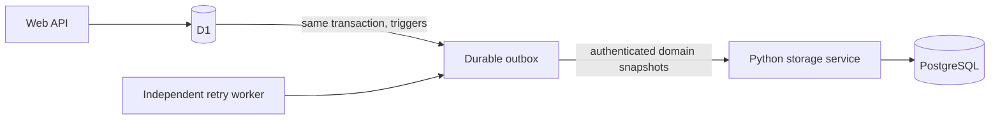

# D1 and PostgreSQL persistence

The web API remains authoritative in D1. With `DATA_STORAGE_MODE=dual`, application
creates, updates and deletes and saved profile changes are also delivered to
PostgreSQL. Connecting the Python rule service no longer bypasses D1 application
storage. The rule-service setting and data-storage setting have separate jobs.

## Data and ownership

- `applications` has the same ID and owner in both databases. PostgreSQL receives
  status, the already masked reference suffix, already redacted notes, checklist,
  frozen decision, scheme version, conversation ID and update time.
- `user_profiles.id` is the existing D1 session ID. `profile`, `confirmed` and
  `provenance` are JSONB; version, language, consent and session expiry are also
  copied. There is no new login or registered-user identity in this change.
- A form confirmation, single-field answer, and a profile update made during chat
  all use the same capture mechanism. Inferred values retain their provenance;
  copying them does not confirm eligibility.
- Deleting an application deletes the PostgreSQL copy. “Delete my data” and D1
  expired-session cleanup remove the PostgreSQL profile and all owned applications.
  PostgreSQL expiry follows D1's existing cleanup timing rather than introducing
  an independent session lifecycle.
- Credentials, raw session tokens and token hashes are not copied into profiles.

## Delivery and failure behavior



`drizzle/0007_storage_mirror.sql` adds a disabled-by-default queue and six capture
triggers. Enabling dual mode atomically queues existing D1 profiles/applications.
Each entity retains its latest pending state; an autoincrement sequence changes
on every edit. Successful delivery acknowledges only the exact delivered sequence.
A concurrent newer edit is therefore never accidentally removed from the queue.

PostgreSQL applies each batch transactionally. Per-owner locks, per-source sequence
checks, and deletion tombstones make duplicate, delayed and concurrent delivery
safe. A deleted owner cannot be resurrected by late application/profile snapshots.
Tombstones contain only IDs and sequence metadata, not profile content.

If PostgreSQL is down, D1 still commits normally and the durable queue remains.
Successful API responses have `X-Storage-Sync: synced` or `pending` in dual mode.
Pending is eventual consistency, not a distributed transaction across databases.
The independent `storage-sync` container retries every ten seconds, including when
no browser is open. Normal successful API requests also attempt one batch.

The initial compatibility import is an exception: an older session whose tracker
previously lived only in PostgreSQL needs one successful PostgreSQL read before its
tracker can switch to D1. A failed import returns a temporary error instead of
showing an empty tracker. New sessions do not require that import. Import and its
completion marker commit atomically; existing D1 rows win owner/scheme conflicts.
PG-only rows belonging to inactive old sessions are retained until that owner's
tracker is accessed or the owner's D1 session is deleted; they are not discarded
as a side effect of enabling dual mode.

All user-facing writes must go through `/api/v1/...`. The backend's older direct
`/v1/applications` endpoints are retained for compatibility, but bypassing the web
API to write them in dual mode bypasses the D1 source of truth.

## Local setup and operations

Compose sets `DATA_STORAGE_MODE=dual`, points `POSTGRES_SERVICE_URL` at the Python
service, and passes service credentials from the existing secret environment.

```powershell
docker compose up -d --build rules web storage-sync
```

The migration container applies idempotent PostgreSQL migrations in filename
order, including `002_user_profiles_and_mirror.sql`. Web startup applies the new
idempotent D1 migration even on an existing `.schema-ready` volume.
`scripts/start-web.mjs` supplies the four new storage bindings through Wrangler's
local runtime secret file, preserving existing rule/AI settings. The consolidated Docker bootstrap SQL lives under `scripts/sql/`,
outside the ordinary numbered migration chain, so a fresh database does not apply
the same columns twice.

For a Cloudflare deployment, apply the D1 migrations, deploy/migrate the Python
service, configure `DATA_STORAGE_MODE=dual`, `POSTGRES_SERVICE_URL`,
`POSTGRES_SERVICE_API_KEY` and `STORAGE_SYNC_KEY` as appropriate environment
variables/secrets, and run the retry script in a persistent worker or call the
private endpoint from a scheduler. The service URL must be reachable from the
Worker; a Docker service name works only inside Compose. This change does not
deploy or modify the remote Cloudflare service automatically.

The private retry endpoint is `POST /api/v1/storage/sync`, with
`Authorization: Bearer <STORAGE_SYNC_KEY>` and
`X-Requested-With: SchemeSathi`. It returns `pending` and `delivered` counts and
fails when delivery fails. Repeat until `pending` is zero. Do not put this key in
browser code or public URLs. Logs contain counts/status, not user data.

Useful PostgreSQL queries (run locally in Adminer or psql):

```sql
SELECT id, profile, confirmed, provenance, version FROM user_profiles;
SELECT id, owner, scheme_id, status, reference, checklist FROM applications;
```

Do not discard the D1 outbox or volume while it contains pending work. Preserve
`storage_sync_config.source_id` and the sequence when moving the same D1 database.
Independent environments must have independent source IDs (generated by migration).
Do not switch dual mode off until the queue is drained and a retention/cutover
decision has been made for the PostgreSQL copies.

## Path to PostgreSQL only

The boundaries are explicit:

- `lib/storage/applications.ts`: application repository contract and D1 adapter.
- `lib/storage/profiles.ts`: profile-save contract and D1 adapter.
- `lib/storage/index.ts`: primary adapter selection and PostgreSQL transport configuration.
- `lib/storage/mirror.ts`: delivery contract, independent of HTTP/environment code.
- `backend/sathi/storage.py`: PostgreSQL persistence, independent of Cloudflare.

The PostgreSQL schema stores complete application/profile data rather than a
D1-specific blob or a reference back to D1. This prepares those domains for a
PostgreSQL primary adapter. **There is not yet a working whole-app `postgres` mode.**
Setting `DATA_STORAGE_MODE=postgres` is rejected instead of silently falling back.

A full cutover must also migrate D1 sessions/authentication, conversations/messages,
reports, voice preferences, feedback, rate limits and audit/review records, and
replace remaining direct D1 queries (including chat's transactional profile update).
These are intentionally still D1-backed in this change. The sequence for that work:

1. Add PostgreSQL adapters and schema for those remaining domains; retain current
   ownership, privacy, concurrency and transaction behavior.
2. Add a validated `postgres` storage selection at the composition boundary and
   run all API tests without a D1 binding to prove it is actually independent.
3. Pause writes briefly, finish compatibility imports/backfills, drain the outbox,
   and compare IDs, ownership, versions and content across both databases.
4. Switch reads/writes together to PostgreSQL. Keep a recoverable D1 snapshot until
   verification finishes, then remove the binding and retire synchronization.

## Verification

```powershell
node --experimental-strip-types --test tests/storage.test.mjs
pnpm typecheck
pnpm test:api
.\backend\.venv\Scripts\python.exe -m pytest -c backend/pytest.ini backend/tests -q
docker compose exec -e RUN_POSTGRES_STORAGE_TESTS=1 rules python -m pytest tests/test_storage.py -q
docker compose exec web pnpm test:storage:live
```

The PostgreSQL integration test creates and drops only its own random temporary
schema. It checks real upserts/deletes, replay ordering, batch rollback, frozen
decision persistence and owner-deletion tombstones.
