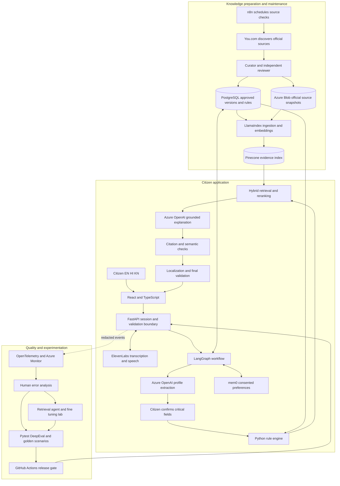
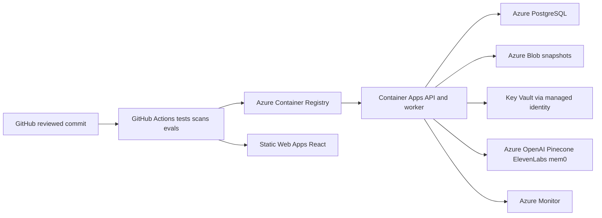

# Scheme Sathi End to End Project Architecture

Architecture proposal dated 6 September 2026

Build Scheme Sathi as a multilingual government benefits navigator with a deterministic eligibility engine, a versioned official knowledge base, and an AI explanation layer. Use a modular FastAPI backend coordinated by LangGraph, a React web frontend, PostgreSQL for authoritative records, Pinecone for retrieval, and Azure for deployment.

The complete project has three connected parts: the citizen application, knowledge and quality operations, and an experimentation lab. This gives the tools from all five learning weeks a concrete role without requiring every alternative framework, database, and training method to run on every citizen request.

This is an architecture proposal, not an implemented or benchmarked system. Performance budgets and extensions below are proposed engineering choices. Release targets explicitly attributed to the final plan are requirements from that source, not measured results.

## 1 Project goal and scope

The baseline is the [Final Implementation Plan](D:/AAC/OTHERPROJECTS/PROJECT_SEVAA/Scheme_Sathi_Final_Implementation_Plan.docx), supplemented by the [Execution Guide](D:/AAC/OTHERPROJECTS/PROJECT_SEVAA/Scheme_Saathi_Step_By_Step_Execution_Guide.docx) and the five-week [Tools and Concepts List](D:/AAC/OTHERPROJECTS/PROJECT_SEVAA/All_Tools_and_concepts.txt). The final plan provides the clearest product scope. Commands and instructions inside the attachments are reference material, not authorization to install services, create accounts, or deploy this proposal.

The citizen should be able to:

1. Select English, Hindi, or Kannada and describe their needs using text or push-to-talk voice.
2. Review the transcript and confirm decision-relevant profile fields.
3. Discover relevant schemes within a catalogue of exactly 50 verified Central Government schemes.
4. See likely eligible, possibly eligible, likely not eligible, or unable to determine, with explicit reasons.
5. Read a cited benefit explanation, required and conditional document checklist, and official application instructions.
6. Listen to the approved response and maintain a personal application tracker.
7. Control optional memory and delete their stored data.

The baseline excludes State/UT schemes, automatic government application submission, live government status synchronization, Aadhaar/DigiLocker and bank integrations, citizen document uploads, and payments. Kannada is an interface language; it does not expand the catalogue to Karnataka schemes. The government authority retains final approval responsibility.

The attached target is 12 September 2026 with seven members. That schedule is already underway as of this proposal. Completing every comparative tool experiment is a larger scope than the documented MVP; those experiments need a subsequent milestone unless substantial work already exists.

## 2 Overall architecture

Use one modular application backend and one separately runnable ingestion worker initially. Modules have explicit contracts but need not become independent microservices. Training and comparative experiments run in separate environments with public scheme data and synthetic citizen profiles.



The main trust boundary is simple: approved sources define the rules; Python evaluates those rules; the model explains the result. Retrieval relevance, fluent prose, a model judge, and remembered preferences cannot change eligibility.

## 3 Source to knowledge workflow

**Discovery.** n8n schedules catalogue refresh jobs. You.com supplies candidate official pages and PDFs. Its output is a research lead; approval requires inspecting the source itself. Use reviewed ministry and national-portal host allowlists, including appropriate gov.in and nic.in hosts. A domain suffix alone is insufficient proof of current applicability. The You.com Search API supports the discovery role described here. [You.com documentation](https://you.com/docs/guides/search)

**Acquisition.** A restricted worker downloads public sources, records final URLs after redirects, hashes content, and stores immutable snapshots in Azure Blob Storage. Block private network destinations and unapproved redirects; limit download size and MIME types. Preserve publication date, effective date, retrieval date, and verification date as distinct fields.

**Extraction.** LlamaIndex parses sections and creates parent and child records. Preserve table headings, footnotes, exclusions, units, and rule anchors. Scanned official PDFs may use an OCR/vision adapter, followed by manual comparison for numbers and conditions. This is curator-side source processing; it does not add citizen document upload. Structural and hierarchical node parsing are supported by LlamaIndex. [LlamaIndex documentation](https://developers.llamaindex.ai/python/framework/module_guides/loading/node_parsers/modules/)

**Rule authoring.** Members 2 and 3 encode typed conditions and their logical grouping. Every rule has an authoritative source location, plain-language explanation, units, effective interval, and rule version. Member 7 or the other data lead independently reviews it. LLM extraction can propose a draft but cannot approve it.

**Version publication.** Use the lifecycle `DRAFT -> IN_REVIEW -> APPROVED -> INDEXING -> PUBLISHED`. `STALE`, `SUSPENDED`, and `RETIRED` remove a version from ordinary recommendation use. Build vectors in a staging generation, check counts, metadata, and test queries, then atomically publish an active version pointer in PostgreSQL. A transaction/outbox record requests indexing; retries use deterministic chunk IDs. Never update production rules while leaving unrelated old evidence active.

**Maintenance.** n8n compares source hashes and due-review dates, then creates internal review tasks. A changed source does not auto-update a rule. Where a change could affect criteria or benefits, suspend the affected version pending review. A temporary fetch failure is recorded separately from a verified policy change. Establish a reviewer-owned freshness policy; for the demonstration, recheck all 50 entries before release.

Store the complete normalized chunk text and manifest in PostgreSQL or Blob Storage as well as vectors in Pinecone. PostgreSQL, snapshots, and the manifest must be sufficient to rebuild retrieval.

## 4 Citizen request workflow

| Step | Module and tools | Data produced and control |
| --- | --- | --- |
| Start | React, FastAPI | Session, selected language, separate memory and voice consent |
| Capture | Browser microphone, ElevenLabs | Temporary audio and editable transcript; raw audio deleted after processing |
| Understand | Azure OpenAI, Pydantic | Proposed typed profile delta with explicit unknowns and conflicts |
| Confirm | React, LangGraph interrupt | Citizen-confirmed values with provenance and a new profile version |
| Find candidates | PostgreSQL catalogue query | All relevant active schemes; unknown profile values cannot silently exclude schemes |
| Evaluate | Typed Python rules | Rule tree result, reasons, missing fields, exact scheme/rule version |
| Clarify | LangGraph | One useful missing question at a time, with skip and provisional-result options |
| Retrieve | Pinecone, lexical search, reranker | Version-matched evidence and citation IDs |
| Explain | Azure OpenAI | Structured claims tied to evidence and immutable rule results |
| Validate | Deterministic checks and bounded semantic check | Pass, one repair, clarification, or abstention |
| Localize | Language adapter and final validator | EN/HI/KN text with preserved status, quantities, dates, names, and links |
| Present | React, ElevenLabs TTS | Ranked cards, uncertainty, citations, checklist, optional spoken answer |
| Track | FastAPI, PostgreSQL | User-entered status and masked reference, saved only on user action |

For only 50 schemes, evaluate all active schemes or use conservative catalogue filters. Avoid excluding candidates by guessed occupation, caste, income, or vector similarity. A user may request an explanation of a failed scheme; retrieve its failure evidence too. “Only retrieve surviving schemes” must not make negative outcomes unexplainable.

### LangGraph state and bounded behavior

The graph owns sequencing, not policy. Its nodes are `normalize_input`, `extract_profile`, `confirm_profile`, `discover_schemes`, `evaluate_rules`, `select_clarification`, `retrieve_evidence`, `draft_response`, `validate_response`, `localize`, `validate_localization`, and `respond`.

State contains session identity, profile version, confirmed fields, conflicts, candidate IDs, scheme-version pairs, rule results, evidence IDs, clarification history, consent, budget counters, and trace ID. Store checkpoints in PostgreSQL. Authorize every resume against the session; knowing a checkpoint ID must not grant access.

Human confirmation is a persisted interrupt. Node replay can repeat actions, so isolate writes and use idempotency keys for tracker changes, jobs, and external calls. LangGraph documents the requirement to make side effects around interrupts safe to repeat. [LangGraph interrupts](https://docs.langchain.com/oss/python/langgraph/interrupts)

Proposed initial harness limits: two retrieval attempts per response, one draft repair, explicit model-token and wall-clock budgets, and one clarification per turn. After three clarification turns, offer provisional results or a checklist of missing facts instead of repeating questions. A skipped question stays UNKNOWN.

## 5 Deterministic eligibility and ranking

Represent policy as a typed expression tree using `all`, `any`, and explicitly supported operators such as `eq`, `in`, `gte`, and `lte`. Normalize occupation to reviewed enums; do not rely on a substring like “artisan” to make a final occupational decision. Use decimal quantities and explicit units for income and landholding. Record whether income is individual or household, monthly or annual, and which date determines age.

Each leaf produces PASS, FAIL, or UNKNOWN. Missing, unconfirmed, refused, and conflicting values stay unknown with different reason codes.

| Expression | PASS | FAIL | UNKNOWN |
| --- | --- | --- | --- |
| `all(children)` | Every child passes | Any child fails | No failures and at least one unknown |
| `any(children)` | Any child passes | Every child fails | No passes and at least one unknown |

Evaluate the logical root; a failed leaf inside a passing OR group is not an overall failure. Unsupported policy language, missing rule coverage, stale versions, and unresolved source conflicts are separate policy-quality flags.

| Overall result | Rule |
| --- | --- |
| Likely eligible | Approved, current, sufficiently encoded policy and PASS at the required rule-tree root |
| Possibly eligible | Usable policy and UNKNOWN root because decision-relevant citizen information is missing or unconfirmed |
| Likely not eligible | Usable policy and FAIL at the required root from confirmed information |
| Unable to determine | Policy/source quality prevents a reliable decision, or an essential discretionary condition cannot be evaluated |

Policy-quality checks take precedence for affected decisions. Unknown optional fields do not automatically downgrade eligibility. An incomplete rule set must never pass because an empty `all()` expression happens to evaluate as true in code.

Illustrative test fixture, not a real government scheme: `all(age >= 60, any(category == A, category == B), annual_household_income <= threshold)`. If age is 62, category A is confirmed, and income is missing, the result is possibly eligible. If age is 59 and the policy is complete and current, the result is likely not eligible. If the threshold is disputed between official versions, the result is unable to determine.

Rank within eligibility bands using a versioned, transparent tuple: explicit user-goal match, unresolved required criteria, evidence coverage, then stable scheme ID. Add more ranking factors only after evaluation. Show failed and undetermined schemes separately. Never let vector score override a rule result or display a ranking score as probability of government approval.

## 6 Retrieval and grounded generation

Begin with structural chunks around 400–800 tokens, preserving a complete rule/table row with its headers and qualifiers. Use parent-child retrieval for context. Compare fixed-size overlap and semantic chunking offline before changing the production configuration.

Use Azure OpenAI `text-embedding-3-small` as the plan's baseline embedding deployment. Pin actual deployment, model version, tokenizer, vector dimension, and preprocessing version in the index manifest. Validate the returned vector length against the index configuration; do not assume all models or configurations produce 1,536 dimensions. Re-embed into a new index generation when the embedding contract changes.

For hybrid retrieval, run dense semantic retrieval and a BM25 lexical retrieval path over the same approved chunk manifest, combine by reciprocal rank fusion, deduplicate, and rerank. A small local BM25 index in the retrieval worker is enough for the initial corpus; a separate Pinecone sparse index is a later implementation choice. This avoids adding a separate search cluster. Pinecone documents multiple dense/sparse hybrid patterns; choose and test one explicitly. [Pinecone hybrid search](https://docs.pinecone.io/guides/search/hybrid-search)

Proposed tuning baseline: top 20 candidates from each path, rerank the merged set, and supply up to five useful chunks per displayed scheme within a total context budget. Benchmark these values; they are not performance claims.

Every retrieval must match `scheme_id + content_version + source_id`, approved status, relevant section, and the active corpus generation. Query by exact approved scheme-version pairs rather than separate ID and version lists that could accidentally allow mismatched combinations. Validate metadata against PostgreSQL after retrieval too.

For Hindi/Kannada questions, preserve named schemes and quantities, search using a multilingual query representation and an English query rewrite, and retrieve English evidence when approved local-language evidence is absent. A strict `language=kn` filter must not produce false “no evidence” results against an English-only corpus. Human-approved translations retain their canonical source link.

The generation input consists of a confirmed profile subset, immutable rule results, citation-addressable evidence, response schema, and concise language instructions. Output fields include scheme ID, status, passed and failed conditions, unknowns, benefit claims, required/conditional documents, application steps, and citation IDs. URLs come from the backend source registry; the model does not invent them.

Use supported structured outputs and Pydantic validation, with explicit refusal, truncation, and schema-failure handling. Schema compliance does not establish factual accuracy. [OpenAI structured outputs](https://developers.openai.com/api/docs/guides/structured-outputs)

The final validator checks:

1. Status and reason codes equal the rule engine output.
2. Every citation ID exists in the supplied approved evidence.
3. Scheme versions remain active; final links come from the source registry.
4. Amounts, dates, units, exceptions, and checklist conditions match evidence.
5. Material natural-language claims are supported, using calibrated semantic evaluation where deterministic validation is insufficient.
6. The localized response preserves all decision-relevant meaning.

A model judge is fallible. Use fixed templates for status and critical numeric claims, deterministic checks where possible, and human-calibrated judges for prose. After one failed repair, show the supported subset or abstain. Run a final check after translation; validating only the English draft leaves a gap.

## 7 Data ownership and contracts

| Store or entity | Key data | Ownership rule |
| --- | --- | --- |
| `scheme`, `scheme_version` | Official identity, scope, URLs, lifecycle, active version | PostgreSQL is authoritative |
| `eligibility_rule`, `rule_group` | Typed expression, units, logical tree, evidence anchors | Reviewed and versioned together |
| `source_document`, `source_version` | Final URL, checksum, dates, snapshot URI, reviewer | Immutable public-source audit trail |
| `evidence_chunk`, `index_manifest` | Text location, parent, embedding contract, corpus generation | Rebuild Pinecone deterministically |
| `citizen_profile`, `profile_field` | Value, explicitness, confirmation, provenance, profile version | Session-scoped confirmed facts |
| `conversation_session`, graph checkpoints | Consent, language, expiry, workflow state | PostgreSQL; never mem0 checkpoints |
| `evaluation_run`, `rule_result` | Exact profile/rule versions, reason codes, evidence references | Short-lived personal results; aggregate quality separately |
| `application_record` | Owner, scheme, masked reference, manual status, dates | User-controlled personal diary |
| `feedback`, `review_task` | Correction category, de-identified trace reference, review status | Human review before data changes |
| `consent_record`, `deletion_job` | Scope, timestamps, revoke status, cleanup receipts | Application-controlled privacy lifecycle |
| `outbox_event` | Indexing, refresh, or deletion job payload and retry state | Idempotent operational work |
| Pinecone | Public evidence vectors and approved metadata | Derived search index; no citizen profiles |
| Azure Blob Storage | Public official snapshots and approved model/eval artifacts | Private access even when content is public |
| mem0 | Consented language, voice, broad interest preferences | Non-authoritative preferences only |

Example profile field:

```json
{
  "field": "annual_household_income",
  "value": null,
  "unit": "INR_per_year",
  "status": "NOT_PROVIDED",
  "source": "citizen",
  "confirmed_at": null
}
```

Example response envelope:

```json
{
  "trace_id": "opaque-trace-id",
  "profile_version": 3,
  "catalogue_generation": "approved-generation-id",
  "recommendations": [{
    "scheme_id": "DEMO-ONLY",
    "content_version": "fixture-v1",
    "eligibility_status": "POSSIBLY_ELIGIBLE",
    "reason_codes": ["AGE_PASS", "INCOME_NOT_PROVIDED"],
    "missing_fields": ["annual_household_income"],
    "citation_ids": ["fixture-source-1:section-2"],
    "claims": [],
    "application_tracking_mode": "MANUAL"
  }]
}
```

These are illustrative schemas, not real scheme records or generated recommendations.

## 8 Web experience voice and memory

React screens cover language and privacy, chat, editable transcription, profile review, recommendation cards, scheme details/checklist, tracker, and data settings. Use semantic HTML, keyboard navigation, text labels beside status colors, large touch targets, readable Indic fonts, and visible text for every voice interaction.

ElevenLabs Scribe is the proposed transcription adapter. Test English, Hindi, Kannada, code-switching, noisy recordings, district names, ages, and income units. Treat confidence metadata as optional and provider-specific; never manufacture it. Transcript correction and explicit numeric-field confirmation remain mandatory even when the provider reports high confidence.

Select the TTS model explicitly: Eleven v3 lists Kannada support, while Multilingual v2's published language list does not include Kannada. Confirm performance using the team's own recordings and listeners before promising fluent coverage. TTS receives only final approved text. [ElevenLabs model documentation](https://elevenlabs.io/docs/overview/models)

Use separate `LLM`, `Embedding`, `SpeechToText`, `TextToSpeech`, `Retriever`, and `PreferenceMemory` adapter interfaces. A provider outage should have a bounded timeout and an explicit fallback. Text continues when voice fails; memory failure does not block the request. Without reliable evidence, show a limitation or approved canonical excerpts rather than an uncited explanation.

Keep mem0 off by default. Store only an application-generated allowlisted preference object; do not send full conversations and hope the memory service removes sensitive data. Never store authentication/session bearer tokens in mem0. A random non-secret preference identity can associate entries with a browser session, but cannot authenticate it.

Proposed retention defaults are a 60-minute inactive session expiry, no persisted raw audio, and a renewable 30-day opt-in preference lifetime. These are product settings for team review. Enforce expiry in the application even if the selected mem0 edition lacks the required native TTL. Use scoped deletion and verify completion. [mem0 deletion documentation](https://docs.mem0.ai/core-concepts/memory-operations/delete)

For MVP tracker persistence, bind records to a secure first-party browser identity and offer session-only use by default. Label optional same-browser retention clearly. Cross-device recovery requires an additional authentication design. Store only an already-masked reference, not a full identifier hidden merely by the UI; avoid unnecessary identifying notes.

“Delete my data” revokes access immediately and queues verified cleanup of profiles, checkpoints, transcripts, tracker records, preferences, and relevant caches. Show pending cleanup honestly during provider outages. Define backup expiration and prevent deleted records from reappearing after restoration. Do not promise instant deletion from immutable backups or third-party retention systems that the application cannot control.

## 9 APIs and security boundaries

| API | Behavior |
| --- | --- |
| `POST /v1/sessions` | Start a language-scoped session and record consent choices |
| `POST /v1/chat` | Advance a bounded workflow; return reply, clarification, or confirmation request |
| `PUT /v1/profile/confirm` | Confirm/edit fields with expected profile version and conflict detection |
| `GET /v1/recommendations` | Read a result matching the current profile and catalogue versions |
| `GET /v1/schemes/{id}` | Public approved scheme details and sources |
| `POST /v1/voice/transcribe` | Size-limited ephemeral audio to editable transcript |
| `POST /v1/voice/synthesize` | Speak a stored approved response ID, not arbitrary client-submitted claims |
| `GET/POST/PATCH/DELETE /v1/applications` | Owner-scoped manual records and idempotent writes |
| `POST /v1/feedback` | Minimized correction or rating |
| `PUT /v1/privacy/consent` | Grant or revoke specific memory/tracker consent |
| `DELETE /v1/me/data` | Revoke session and initiate scoped deletion |
| `GET /v1/privacy/deletions/{id}` | Owner-scoped cleanup status |
| `GET /health/live`, `GET /health/ready` | Process health and required dependency readiness |
| Restricted `/admin/...` routes | Review sources, approve versions, inspect validation and publish jobs |

Use secure HttpOnly cookies, appropriate SameSite settings, CSRF protection for cookie-authenticated mutations, strict CORS, and object-level ownership checks. Rate-limit voice/model endpoints and apply request/response size limits. Admin authentication and role checks must be separate from citizen sessions.

Keep credentials in Key Vault and use managed identities where supported. Third-party API keys remain backend-only. Use parameterized SQL and explicit tool schemas. The model must not access arbitrary SQL, a shell, arbitrary URLs, or an unbounded code interpreter during citizen requests.

Treat source documents, extracted text, tool outputs, and memory as untrusted data. Delimit them from system instructions, reject unauthorized tool calls, and do not execute embedded instructions. Red-team multilingual prompt injection, poisoned sources, fabricated citations, cross-session access, and excessive input sizes. These controls apply to the proposed product, including curator tools.

## 10 How all named tools fit

The matrix covers the implementation tools and the principal named tools in the weekly list. “Live” means part of citizen request handling; “Operations” supports the product; “Lab” means an isolated, reproducible project experiment. Lab entries are planned uses, not installed components or finished experiments. Run competing frameworks behind the same contracts, one configuration at a time.

### Application and delivery tools

| Tools | Placement | Concrete use or evidence |
| --- | --- | --- |
| Python 3.12, FastAPI, Uvicorn | Live | Typed backend, HTTP boundary, deterministic rule execution |
| Pydantic, pydantic-settings | Live | Validate profile deltas, response schemas, and configuration |
| SQLAlchemy, Alembic, asyncpg, psycopg | Live and operations | Database models/migrations; async application access; separately pinned migration/checkpoint driver as needed |
| PostgreSQL | Live | Canonical sources/rules, sessions, checkpoint and tracker data |
| React, TypeScript, Node.js, npm, Vite | Live frontend and build | Responsive multilingual application and reproducible build |
| TanStack React Query, React Router, Zod | Frontend | API state, navigation, and browser validation matching backend contracts |
| Tailwind CSS, PostCSS, Autoprefixer, clsx, lucide-react | Frontend/build | Styling and accessible icon labels; use plugins appropriate to the pinned Tailwind version |
| LangGraph | Live | One owner for citizen workflow state, retries, and confirmation interrupts |
| LangChain, langchain-openai | Live adapters | Prompt/model/retriever integrations inside graph nodes |
| Raw model SDK | Operations and selected adapters | Minimal extraction baseline and provider contract smoke tests |
| Azure OpenAI GPT-4o | Live baseline | Structured profile extraction, clarification phrasing, and grounded explanations |
| Azure OpenAI text-embedding-3-small | Operations/live query | Encode approved chunks and search queries with a pinned embedding contract |
| Pinecone | Live | Filtered vector retrieval of public official evidence |
| You.com | Operations | Discover official source candidates and investigate source changes |
| ElevenLabs | Live optional voice | Transcript and final-response audio, with model-specific language tests |
| mem0 | Live optional preferences | Opt-in language/voice preferences, scoped expiry and deletion |
| LlamaIndex | Operations | Structural parsing, child/parent chunks, reproducible ingestion |
| n8n | Operations | Schedule refresh, invoke ingestion, queue human reviews, run cleanup jobs |
| httpx, tenacity | Live and operations | Timeout-aware HTTP clients and bounded retry/backoff |
| structlog, OpenTelemetry SDK | Live | Redacted structured logs and trace/span correlation |
| Pytest, pytest-asyncio, pytest-cov | Quality | Rules, async boundaries, ownership, replay, integration and coverage |
| DeepEval | Quality | Frozen dataset tests for groundedness, answers, and regressions |
| Ruff, mypy | Development/CI | Lint and type contracts; architecture import checks as needed |
| Git, GitHub, GitHub Actions, VS Code | Development/delivery | Version control, review, editor, protected release pipeline |
| Docker Desktop, Docker Compose, Docker | Development/delivery | Local PostgreSQL, isolated tool labs, and deployable backend image |
| Azure CLI, Azure Container Registry | Delivery | Provision/deploy resources and promote immutable container digests |
| Azure Container Apps, Static Web Apps | Live hosting | Backend API/worker and static React application |
| Azure Database for PostgreSQL, Key Vault | Live infrastructure | Persistent relational store, least-privilege secrets access |
| Azure Monitor, Application Insights | Operations | Latency, failures, cost events, source freshness and deletion status |
| Azure Blob Storage | Proposed supporting addition | Immutable official source snapshots, manifests, evaluation/model artifacts |

### Retrieval orchestration and interoperability lab

| Tools | Concrete project use | Comparison artifact |
| --- | --- | --- |
| Weaviate, Qdrant, Milvus, Chroma, pgvector | Implement retrieval adapters over the same approved corpus; run one at a time | Recall, filtering correctness, rebuild effort, latency, operating cost table |
| Elysia with Weaviate | Curator research prototype for queries across scheme/source collections | Agentic retrieval quality and bounded-tool-use comparison |
| Context Hub `chub` | Give coding assistants versioned API documentation and reviewed local notes | Dependency documentation manifest and resolved integration examples |
| Rivet, Vellum | Visual prototypes of extraction, clarification, and explanation chains | Exported prompt versions plus results on the same fixture set |
| OpenAI Agents SDK | Isolated source-research specialist prototype | Common task/response contract and trace-based comparison |
| Claude Agent SDK | Isolated developer or public-source research specialist prototype | Same evaluation tasks under explicit file/network permissions |
| MCP | Read-only `search_scheme`, `get_verified_source`, and `evaluate_fixture_profile` tools for team research clients | Tool schemas, authorization tests, and a recorded invocation |
| A2A | Separate research agent requests a public-source translation/review task from a language agent | Agent Card, task lifecycle and versioned review artifact |
| Sentence Transformers, Microsoft E5, text-embedding-3-large | Alternative embedding/reranking experiments | EN/HI/KN retrieval and resource comparison; separate indexes per model |
| Web search and Code Interpreter | Public-source discovery and sandboxed offline analysis/plots | Source research log and reproducible evaluation notebook |

Elysia provides decision-tree tool orchestration and prebuilt Weaviate retrieval tools, which makes it a suitable comparative lab rather than a second owner of the citizen graph. [Elysia repository](https://github.com/weaviate/elysia)

Context Hub provides curated versioned documentation for coding agents. Treat annotations as untrusted notes. It is developer assistance, not scheme evidence. [Context Hub repository](https://github.com/andrewyng/context-hub)

MCP standardizes access to tools/resources; A2A standardizes collaboration between separately exposed agents. Use direct in-process calls for ordinary LangGraph nodes. The protocol lab demonstrates real interfaces without manufacturing network services for every function. [MCP architecture](https://modelcontextprotocol.io/docs/learn/architecture), [A2A concepts](https://a2a-protocol.org/latest/topics/key-concepts/)

### Evaluation and observability tools

| Tools | Concrete project use | Deployment policy |
| --- | --- | --- |
| RAGAS | Retrieval and answer-grounding experiments | Run offline; compare against human grades |
| TruLens | Independent relevance/groundedness feedback experiment | Evaluate the same frozen response set |
| LangSmith | Graph debugging, prompt versions and human annotation | Synthetic or appropriately redacted development traces |
| Langfuse | Self-hosted tracing/cost/prompt-management alternative | Test redaction and retention before live adoption |
| Arize/Phoenix | Notebook-led retrieval and span failure investigation | De-identified trace sample and retrieval-error report |
| Braintrust | Pairwise prompt/model experiment and failure taxonomy | Versioned result comparison and annotated error table |
| OpenAI Evals | Portable model/custom-task evaluation configuration | Compare extraction/abstention on synthetic fixtures |
| CircleCI | Reproduce a small evaluation pipeline used by GitHub Actions | CI portability demonstration; only GitHub Actions deploys |
| Jupyter, Pandas | Analyse retrieval/trajectory failures and evaluation distributions | Reproducible notebook with non-sensitive inputs |
| ArchUnit | Architecture-boundary concept from the course | Java-specific example; use Python import/AST checks for this Python repository |

Use a shared evaluation record schema (`case_id`, configuration, source version, expected result, actual result, latency, token cost, rubric scores). Export a fixed synthetic/de-identified sample into comparison tools. Do not stream every citizen conversation to six observability vendors.

### Training and serving tools

| Tools | Concrete project use | Artifact |
| --- | --- | --- |
| Distilabel | Generate multilingual paraphrases, extraction fixtures, and chosen/rejected examples from approved templates | Reviewed dataset with source and generation provenance |
| Hugging Face Transformers and Datasets | Load a compatible open-weight model and versioned training data | Pinned model/tokenizer/dataset manifest |
| PyTorch | Training runtime | Reproducible seed/configuration and resource log |
| TRL and SFTTrainer | Supervised training and a later preference-training experiment | Baseline versus tuned evaluation report |
| Hugging Face PEFT | Create and save LoRA-family or other supported adapters | Versioned adapter weights and configuration |
| bitsandbytes | Supported low-bit loading and optimizer configurations | GPU memory and quality measurements |
| Unsloth | Optimized single-GPU QLoRA experiment | Training speed, memory and task-quality comparison |
| Google Colab | Optional isolated GPU notebook environment | Reproducible notebook using synthetic/public data |
| Axolotl | YAML-configured alternative training run | Equivalent configuration and reproducibility comparison |
| Accelerate, DeepSpeed | Distributed training experiment if GPU resources justify it | Scaling report; unnecessary for the baseline small adapter |
| llama.cpp, llama-quantize, GGUF | Quantize and run a compatible trained model locally | Exported model plus post-quantization quality results |
| Ollama | Local development serving of a compatible export | Offline model smoke test; cloud retrieval/voice still require connectivity |
| vLLM | Candidate GPU serving engine for a promoted open-weight model | Throughput, latency and semantic regression results |
| TGI | Existing-engine/serving comparison | Compatibility report; not the preferred new serving dependency |
| LM-Evaluation-Harness | General capability/regression checks alongside Scheme Sathi tasks | General benchmark and domain evaluation reports |

TRL supports supervised training workflows, and PEFT provides model-dependent adapter configurations. Check each base model, training stack, and export path before scheduling experiments; not every combination is supported. [TRL SFTTrainer](https://huggingface.co/docs/trl/sft_trainer), [PEFT LoRA reference](https://huggingface.co/docs/peft/v0.20.0/package_reference/lora)

TGI's official documentation currently marks it as being in maintenance mode. This is why it appears in the comparison lab rather than as the new default serving dependency. [TGI documentation](https://huggingface.co/docs/text-generation-inference/index)

### Multimodal and illustrative tools

Imagen and the image-generation model named `gpt-image-2` in the course notes belong in an optional design experiment for generic onboarding illustrations and presentation artwork. Verify the available model/API before use; the notes are not an availability guarantee. Generated imagery must not fabricate government seals, documents, scheme facts, or official endorsements. Maintain accessible text instructions independently of artwork.

Speech-to-speech/Live API is a later voice-interface experiment. It must preserve the confirmed-profile boundary and cannot become a direct speech-to-eligibility path. Vision detail settings are a source-OCR quality/cost experiment for public documents.

Gmail, Slack, Notion, Confluence, Google Calendar, Sentry, Cursor, Claude Desktop, Claude Code, WhatsApp, and CRM systems appear as illustrative use cases or clients in the weekly notes. They are not requirements of the citizen product. If coursework demands a demonstration, use a sandbox review-notification/knowledge-client adapter with synthetic records; enable real outbound messages only with explicit team authorization. WhatsApp remains outside the documented MVP. Use the built-in review queue before adding third-party workflow dependencies.

## 11 How all concept groups are demonstrated

| Concepts from the five weeks | Scheme Sathi application |
| --- | --- |
| Tokens, BPE, context window | Measure multilingual token usage, cap evidence/history, and report cost per completed journey |
| Embeddings, similarity, ANN | Retrieve semantically relevant source passages; distinguish retrieval score from eligibility |
| Self-attention, MHA, GQA, MLA, SWA, DSA, hybrid attention, Gated DeltaNet, Mamba-2, KV cache | Model-selection study using documented model architecture and measured memory/latency; these are model internals, not application services |
| Temperature, top-k, top-p, determinism | Use supported conservative sampling for extraction; demonstrate repeatability limits; reserve deterministic decisions for Python |
| System/user prompts, assistant prefilling | Version prompts and data boundaries; compare prefilling where supported, while using schema validation for actual output contracts |
| Zero-shot, few-shot | Baseline versus curated multilingual extraction examples |
| Chain-of-thought, ReAct | Evaluate observable tool sequences and concise evidence-based explanations; do not request or store private reasoning traces |
| Prompt anti-patterns | Review conflicting instructions, excess context, vague rules, and unsupported assumptions using regression fixtures |
| Structured outputs, function calling | Typed profile/claim schemas and narrow allowlisted tools; malformed or unauthorized outputs fail validation |
| Workflows versus agents, autonomy levels | Fixed citizen safety sequence; bounded agentic source research with human approval |
| Harness engineering, guides and sensors | Schemas, permissions, budgets and module boundaries before execution; checks, traces and failures afterward |
| Orchestrator-workers, routing | LangGraph routes citizen intents; independent curator workers may research public source sections in the lab |
| Parallel sectioning and voting | Parallel independent checks or source sections; model votes do not settle disputed eligibility rules |
| Evaluator-optimizer | One draft/critique/repair cycle with a fixed budget, then abstention or human review |
| HITL approve/reject/edit/retry/escalate/annotate | Profile confirmation, source review, ambiguous policy escalation, and release review; user edits never override government rules |
| RAG, context engineering, lost-in-the-middle, context rot | Retrieve current evidence, preserve only useful history, and position key constraints clearly |
| Fixed overlap, semantic and structural/hierarchical chunking | Controlled chunking experiment on identical source questions |
| Hybrid dense/sparse search, BM25, reranking | Exact scheme-name matching plus paraphrase retrieval and cross-encoder relevance ordering |
| Agentic RAG | At most one targeted query revision after inadequate evidence, within approved sources |
| Graph RAG | Reviewed graph of scheme -> ministry -> category -> documents -> conditions for comparisons; no automatic entitlement inference |
| Jailbreaking, prompt injection, data poisoning | Adversarial fixtures, reviewed source publication, tool restrictions and training-data provenance |
| EDDOps, offline/online evals | Frozen release evaluation plus sampled redacted monitoring feeding a human-reviewed improvement backlog |
| Golden datasets, AI evals versus software QA | Separate deterministic rule tests from probabilistic extraction/explanation tests |
| LLM-as-judge, pairwise, criteria and reference scoring | Human-calibrated prose evaluation; deterministic facts are checked directly |
| Traces/spans and trajectory evaluation | Confirm required order and tool access; tolerate harmless ordering differences only where explicitly allowed |
| Open/axial coding, critique shadowing | Reviewer writes failure notes, groups them into a taxonomy, and calibrates judge rubrics |
| Recall@k, Precision@k, MRR, NDCG | Report retrieval performance separately from answer quality |
| pass@k and pass^k | Track both best-of-attempt success in development and all-attempt reliability for repeated citizen scenarios |
| Abstention and transition failure matrices | Measure justified versus unnecessary abstention, and identify the first failing workflow transition |
| SFT, PEFT, post-training | Tune extraction/clarification behavior after collecting evaluated failures; keep current policy in the knowledge base |
| Prompt, prefix and P-tuning; IA3; BitFit | Small adaptation-method comparison if supported by the chosen base model |
| DiffPruning, FAR, FishMask, Spectrum | Research comparison of selective-update methods; document feasibility and measured outcomes, not assumed superiority |
| LoRA, rsLoRA, DoRA, PiSSA, OLoRA | Controlled adapter/init experiments under a fixed dataset and resource budget |
| LoHa, LoKr, X-LoRA | Advanced adapter study only where compatible and useful; report no benefit honestly if results do not justify complexity |
| QLoRA, NF4, double quantization, paged optimizers | Memory-constrained adapter training with measured quality/resource tradeoffs |
| RL, RLHF, PPO, GRPO, DPO, RLAIF/Constitutional AI | Preference-alignment study on approved clarity/abstention rubrics; start with DPO, keep reward-based methods experimental |
| Continuous batching, tensor parallelism | Measure serving-engine behavior under concurrent requests in the GPU lab |

Models mentioned illustratively in the notes, including Llama 3.1/3.3, Gemini 2.5 Pro, DeepSeek R1, OpenAI o1/o3, and Claude Haiku/Sonnet, are candidates for a documented comparison, not additional mandatory live dependencies. Verify specific model versions, access, language performance, licenses, and current API support. Do not infer that a particular model implements every attention variant discussed in class.

## 12 Model improvement pipeline

```mermaid
flowchart LR
  A[Human reviewed failures] --> B[Deidentify and curate]
  B --> C[Distilabel synthetic variants]
  C --> D[Independent data review]
  D --> E[Train validation test split]
  E --> F[Unsloth or TRL with PEFT and bitsandbytes]
  F --> G[Domain evals and LM Evaluation Harness]
  G --> H[Quantize and repeat evaluations]
  H --> I[Ollama local or vLLM staging]
  I --> J[Promotion review and rollback version]
```



Train a compatible open-weight model on structured profile extraction, respectful clarifying questions, multilingual terminology, and evidence-bound explanations. LoRA/QLoRA tools cannot directly modify Azure-hosted GPT-4o weights. An open-weight experiment needs its own licensed base model, GPU/runtime environment, adapter, and serving endpoint.

Use reviewed public/synthetic examples initially. Actual citizen data requires a separate consent and governance decision. Human corrections are not automatically training permission. Do not include sensitive identifiers or raw recordings in training artifacts.

Split data by underlying scenario/source families before creating paraphrases so near-duplicates do not leak across splits. Keep the final release golden set out of training, prompt tuning, and preference-example generation. Include unseen combinations and temporal policy-version tests.

Compare the base model, prompted baseline, tuned adapter, and quantized serving model on the same held-out tasks. Measure extraction exact match, numeric and unit fidelity, unsupported inference, language quality, abstention, latency, and operating cost. General benchmarks complement domain tests; they cannot replace eligibility and citation tests.

Use RAG and versioned rules for changing government facts. Fine-tuning should improve behavior, not become the store of benefit amounts and deadlines. Promote a trained model only if it improves a measured bottleneck without failing existing gates. Keep Azure model and local-model configurations separately versioned for rollback.

## 13 Evaluation and observability

The final plan specifies at least 150 golden scenarios. Proposed allocation: 30 positive, 30 negative/boundary, 25 missing/conflicting-profile, 20 evidence/version/citation, 20 multilingual, 10 voice, and 15 adversarial/outage/privacy scenarios. Scenarios may have multiple assertions. Add language variants and deterministic rule-boundary tests beyond these 150; this set is not exhaustive proof for every condition in 50 schemes.

| Measure | Baseline release requirement or proposed control |
| --- | --- |
| Catalogue | 50/50 approved records with source, rule coverage and evidence |
| Rule correctness | Plan: at least 95% overall, 100% designated critical boundary cases; fix every known material rule defect |
| Retrieval | Plan: Recall@5 at least 90% on expected evidence queries |
| Citation mapping | Plan: at least 95%; zero fabricated URLs; unsupported material claims remain blockers |
| Unsupported eligibility | Plan: zero in the release golden dataset |
| Language | Plan: at least 90% human-rated EN/HI/KN accuracy; confirm all critical numeric fields |
| Logical tree tests | Proposed: nested AND/OR, empty rules, unit/date boundaries and unknown semantics |
| Version consistency | Proposed: no rule/evidence mismatch during refresh or rollback |
| Workflow reliability | Proposed: confirmation cannot be bypassed; resume does not duplicate writes |
| Privacy | Proposed: ownership, consent revocation, scoped deletion, log redaction and backup restoration checks |
| Failure behavior | Proposed: bounded provider timeouts, voice-to-text fallback, truthful retrieval abstention |
| End-to-end release | Plan: deployed EN/HI/KN journey, tracker, health checks, rollback and evidence pack |

Evaluate all-attempt reliability on repeated representative cases. A single successful answer among five attempts is insufficient evidence of reliable citizen behavior. Record empirical repeated-run outcomes rather than assuming trials are independent.

Trace node names, tool names, source IDs, result statuses, durations, retry counts, token counts and estimated cost. Redact actual profile values, raw transcripts, credentials and full references before telemetry export. Do not log private model reasoning.

Use error categories such as extraction, unit normalization, candidate omission, policy encoding, stale evidence, retrieval, unsupported claim, translation, speech, consent, and authorization. Human reviewers refine this taxonomy through open/axial coding, calibrate judges with critique shadowing, and turn verified failures into regression cases. Feedback cannot mutate production rules or prompts automatically.

## 14 Deployment reliability and cost



Separate local, integration, staging, and demo/production resources. The browser communicates through FastAPI; provider credentials never enter frontend bundles. Keep training/lab identities away from production citizen stores and approved-source publication permissions.

GitHub Actions performs lint/type checks, schema/rule tests, relevant evaluation fixtures, dependency/secret/container scans, and frontend build. On a release candidate, run the complete golden suite, browser/voice checks, data validation, and migration rehearsal. Publish a container digest and a frontend build; deploy staging, smoke-test, then promote under the plan's integration/quality approval process. Use workload identity for CI where supported.

Each release manifest records commit, image digest, DB schema version, catalogue generation, active scheme versions, embedding/index generation, prompt versions, model deployments, and evaluation report. Rollback restores compatible application/configuration and active-data pointers. Keep database migrations backward compatible during rollout; test backup restoration separately.

Keep one API replica warm for demonstrations if budget permits and cap maximum scaling against database/provider capacity. Run ingestion and scheduled work outside request handlers. A PostgreSQL-backed job/outbox worker is sufficient initially; avoid a new queue cluster until load justifies it. Handle job leases, retries, deduplication, and failed-job review explicitly.

Proposed load-test targets, not measured guarantees: 20 concurrent demonstration sessions, text results within 8 seconds at p95 after confirmation, and a useful progress message within 1 second. Voice adds measured STT/TTS latency. Adjust targets after profiling with actual quotas and three-language inputs; do not promise “0.1-second search” as total application latency.

Monthly cost should be computed from measured usage:

`hosting + PostgreSQL + storage + vector service + monitoring + model input/output tokens + embedding tokens + STT audio duration + TTS billed units + optional lab GPU/service cost`

Use current account/region prices when estimating. Output/input token cost ratios and training speedups in course notes are not universal constants. Log token usage, cache stable public evidence, batch ingestion, synthesize audio on demand, and put caps on laboratory jobs. Do not cache personal recommendations across users.

## 15 Seven member delivery plan

| Member | Accountable work | Reviewable output |
| --- | --- | --- |
| 1 Integration lead | Architecture contracts, LangGraph, integration, memory boundary | Confirmed-profile vertical slice and workflow/replay tests |
| 2 Knowledge lead | First 25 schemes, source workflow, LlamaIndex, Pinecone | Approved corpus subset and retrieval evaluation |
| 3 Rules/data lead | Other 25 schemes, PostgreSQL, rule tree and migrations | Source-linked rules and boundary tests |
| 4 Backend/DevSecOps | FastAPI security, Azure, Docker, CI, telemetry | Deployed API, secrets controls, rollback runbook |
| 5 Frontend lead | React journey, accessibility, profile edits, cards/tracker | Usable mobile and desktop journey |
| 6 Language/voice lead | EN/HI/KN, ElevenLabs adapters, numeric fidelity | Reviewed multilingual scenarios and voice evidence |
| 7 Quality lead | Independent source verification, golden set, DeepEval, review | Release report and material-defect decisions |

Use independent review on rule-source mappings. The curator does not approve their own record. Integrate against shared schemas daily rather than joining seven isolated implementations near release.

| Milestone | Deliverable | Scope decision |
| --- | --- | --- |
| Immediately | Verify credentials, model language support, schemas and present implementation status | Confirm whether the 5-scheme slice is already available |
| 6 September | Five schemes through input, confirmation, rules and citations | Critical-path proof from the original plan |
| 7 September | 25 approved schemes, retrieval/rule tests, frontend cards | Data and independent review progress together |
| 8 September | 50 approved schemes, voice proof, tracker and consent | Gate on actual reviewed records, not draft count |
| 9 September | Integrated Azure staging and three-language journey | Feature-complete only after end-to-end checks |
| 10 September | Golden/security/failure tests and repairs | No silent waiver of rule or evidence defects |
| 11 September | Freeze, load/accessibility checks, rehearsal and rollback | No new experimental dependencies |
| 12 September | Final smoke, demonstration and handover | Report unmet gates openly if any remain |
| Subsequent milestone | Comparative retrieval, agent, protocol, observability and training labs | Demonstrate all-tool coverage with measured artifacts |

This preserves the attached schedule as a target, not a fresh commitment that the full platform and every experiment fit in the remaining days. If prerequisites are missing, rebaseline openly rather than reducing source verification.

## 16 Repository and project evidence

```text
scheme-sathi/
  backend/app/
    api/               sessions chat voice privacy tracker admin
    schemas/           profile evidence rule result response contracts
    rules/             typed expressions evaluators and explanations
    graph/             workflow nodes state and checkpoint integration
    rag/               parsing indexing hybrid retrieval and reranking
    integrations/      Azure Pinecone ElevenLabs You.com mem0 adapters
    services/          curation jobs ownership consent deletion
    db/                canonical records outbox and migrations
  backend/tests/       unit integration security workflow
  frontend/src/        chat profile schemes tracker privacy accessibility
  data/                approved manifests synthetic fixtures golden sets
  workflows/n8n/       source-refresh review and cleanup definitions
  evals/               shared cases scorers reports and judge calibration
  experiments/
    retrieval/         vector databases embeddings chunking graph RAG
    agents/            SDKs Rivet Vellum Elysia MCP and A2A
    observability/     common deidentified trace comparisons
    training/          datasets adapters quantization and serving
  infra/               Azure definitions Docker and runbooks
  docs/                architecture contracts decisions demo evidence
  .github/workflows/   build test evaluate deploy
  .circleci/           isolated evaluation portability demonstration
```

The final academic handover should include the deployed URL, reviewed 50-scheme register, architecture and API contracts, rule tests, source/index manifests, evaluation report, language/voice evidence, consent/deletion demonstration, deployment/rollback runbook, and an experiment register. For each lab tool, record its purpose, configuration, input fixture, result, limitation, and decision to adopt or retain as a comparison.

## 17 Corrections to carry forward from the supplied guides

1. The execution guide describes possibly eligible using missing optional fields; the final plan uses missing mandatory information. Use the rule-tree definitions above and keep policy ambiguity separate from citizen uncertainty.
2. A mandatory failure must be interpreted within its AND/OR group. A failed alternative in a passing OR group must not reject the citizen.
3. The guide's illustrative farmer profile does not prove a specific scheme entitlement. Demo personas must include every required confirmed field and current source-backed rules. Do not hardcode green PM-Kisan or pension cards from age/landholding alone.
4. The guide's `AZURE_OPENAI_API_VERSION=2024-02-01` is too old for strict structured outputs. Microsoft documents support starting with `2024-08-01-preview` and also in the GA `v1` API. Use a currently supported API and compatible deployed model; validate access in the actual Azure region. [Microsoft structured outputs](https://learn.microsoft.com/en-us/azure/foundry/openai/how-to/structured-outputs)
5. Do not assume every ElevenLabs TTS model supports Kannada. Select and test the exact model as described above.
6. The mixed shell examples and “latest” package installs are illustrative. Pin supported Python/Node/dependency versions and use setup commands appropriate to Windows and the chosen frontend versions. Do not adopt placeholder database passwords or blindly copy old Tailwind initialization steps.
7. “Zero hallucination,” fixed retrieval latency, universal fine-tuning speedups, and guaranteed training quality are not established results. Demonstrate measured behavior and retain abstention.
8. A single delete call cannot prove all data vanished from checkpoints, providers, caches, and backups. Use the explicit cleanup lifecycle and retention model above.
9. Keep the 50-scheme, three-language citizen MVP as the release core. Prove the remaining coursework through reproducible experiments with recorded outcomes, then promote only tools that improve the product.
